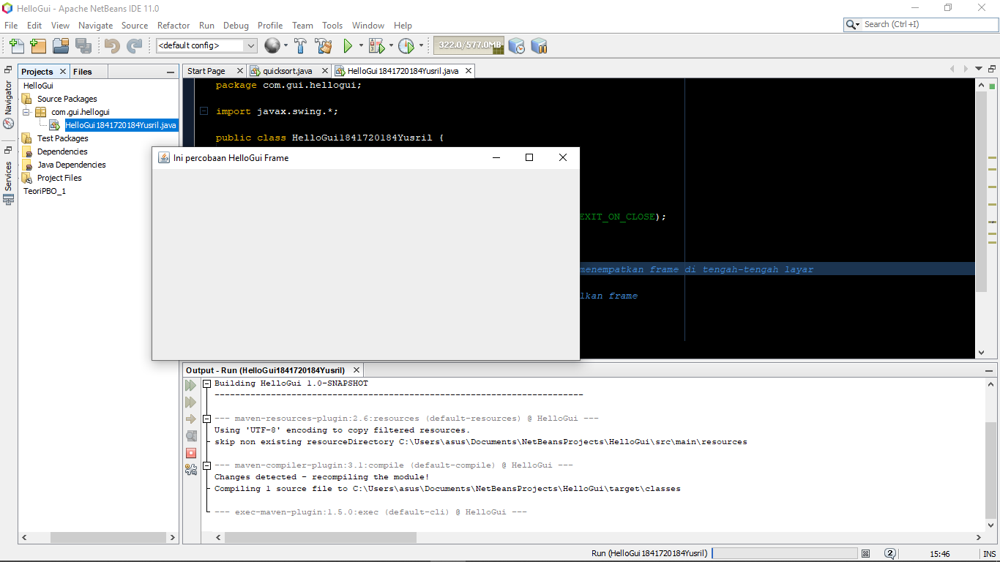
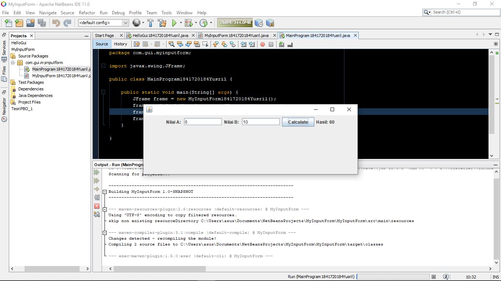
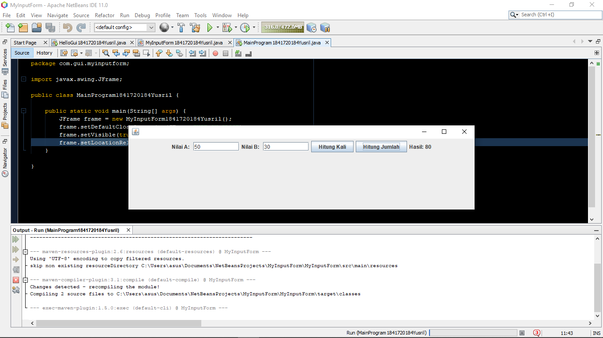
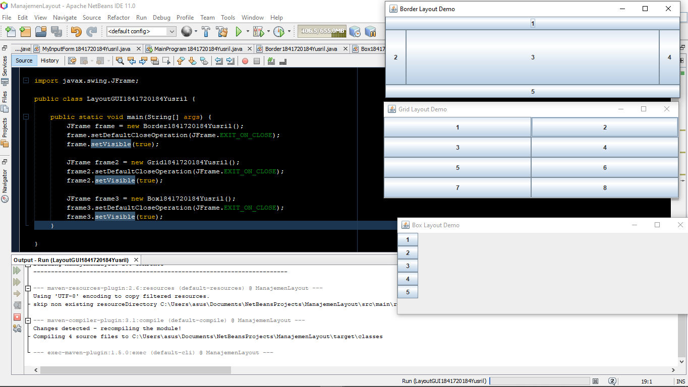
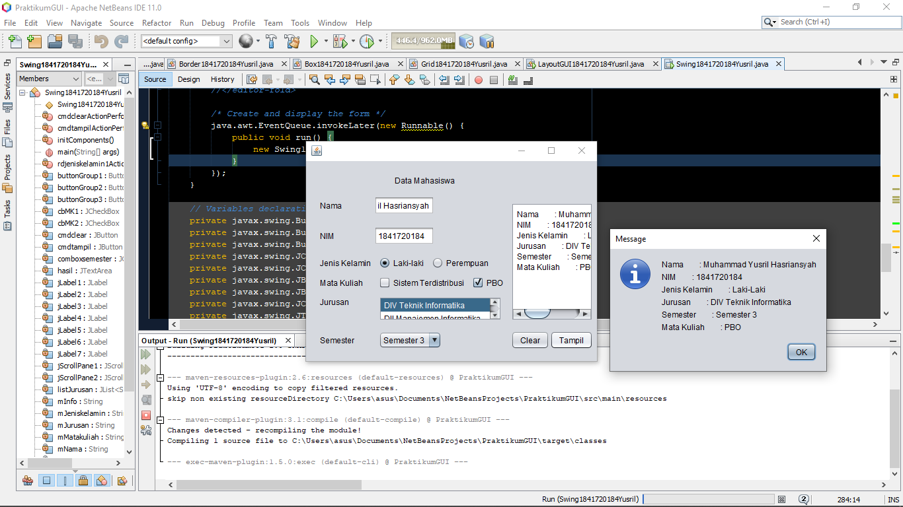
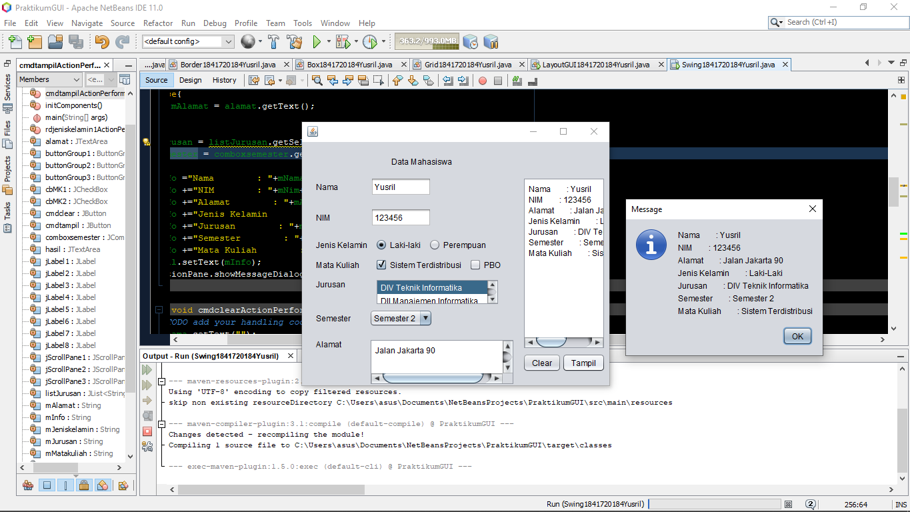
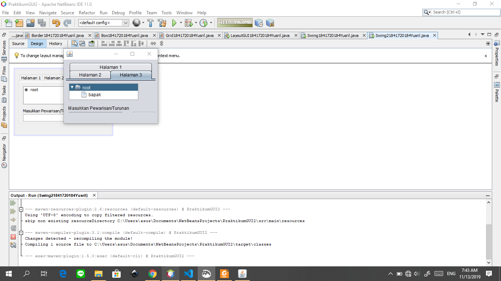
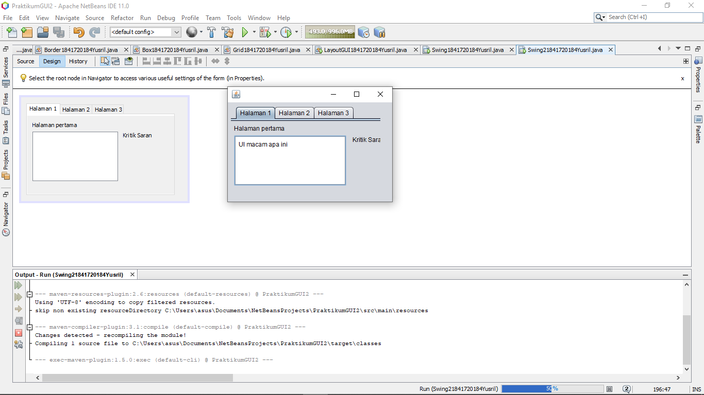
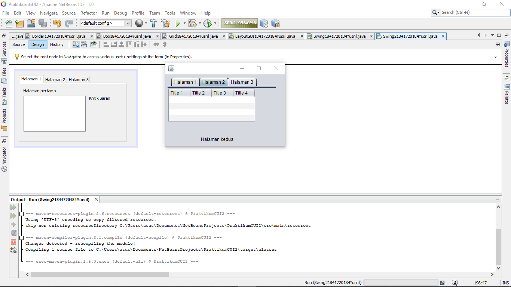
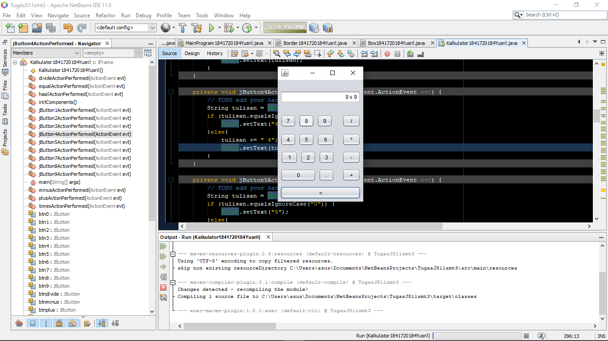

# Laporan Praktikum #11 - GUI

## Kompetensi
Setelah menyelesaikan lembar kerja ini mahasiswa diharapkan mampu:
1. Membuat aplikasi Graphical User Interface sederhana dengan bahasa pemrograman java;
2. Mengenal komponen GUI seperti frame, label, textfield, combobox, radiobutton, checkbox,
textarea, menu, serta table;
3. Menambahkan event handling pada aplikasi GUI.

## Ringkasan Materi

GUI (_Graphical User Interface_) menurut sepemahaman saya adalah bentuk desain dari program yang telah dibuat sebelumnya, fungsinya untuk mempermudah user menggunakan aplikasi tersebut. Sehingga user tidak perlu membaca ribuan baris kode saat menggunakan aplikasi tersebut.

## Praktikum
### Percobaan 1
Percobaan pertama ini hanya membuat frame sederhana.

 

#### Kode Program

- [Tester 1](../../src/10_Polimorfisme/Tester11841720184Yusril.java)
- [Permanent Employee](../../src/10_Polimorfisme/PermanentEmployee1841720184Yusril.java)
- [Employee](../../src/10_Polimorfisme/Employee1841720184Yusril.java)
- [Payable](../../src/10_Polimorfisme/Payable1841720184Yusril.java)
- [Internship Employee](../../src/10_Polimorfisme/InternshipEmployee1841720184Yusril.java)
- [Electricity Bill](../../src/10_Polimorfisme/ElectricityBill1841720184Yusril.java)

### Percobaan 2
Percobaan kedua ini adalah mengenai inputan pada GUI, baik cara _setting_ ***textfield*** nya hingga cara mengambil data dari inputan pada textfield tersebut.

#### Pertanyaan
Berikut adalah hasil modifikasi dari kode program diatas.

#### Kode Program

- [Tester 2](../../src/10_Polimorfisme/Tester21841720184Yusril.java)

### Percobaan 3
Percobaan ketiga ini adalah melakukan manajemen pada layout GUI, yaitu mengatur posisi dan ukuran dari layout. Terdapat tiga macam layout pada GUI  yaitu **Box**, **Grid**, dan **Border**

#### Pertanyaan
1. Perbedaan dari **Grid**, **Box** dan **Border** Layout adalah pada peletakan posisi dan tampilannya pada saat program berjalan

2. fungsi dari 
- JFrame frameObject = new (Layout()) adalah untuk melakukan casting sesuai layout yang diinginkan, gunanya untuk membuat layout terpanggil pada sebuah frame.
- `setDefaultCloseOperation(JFrame.EXIT_ON_CLOSE)` berfungsi untuk mengatur program otomatis stop ketika frame di*close*
- `setVisible(true)` berfungsi untuk menampilkan Frame

#### Kode Program

- [Tester 3](../../src/10_Polimorfisme/Tester31841720184Yusril.java)

### Percobaan 4

percobaan keempat ini adalah memanfaatkan GUI secara langsung dengan kombinasi sedikit _native code_.

#### Pertanyaan
1. Untuk membuat JFrame muncul dan menjadi terlihat.

2. Karena terdapat dua tombol pilihan logika untuk checkbox dan radio button sehingga ketika hendak mengganti pilihan dari satu radio ke satunya maka hasilnya atau outputnya pun bisa berganti

3. hasil modifikasi:

### Percobaan 5
Percobaan terakhir ini adalah memanfaatkan panel tab.

#### Pertanyaan
1. JTabpane berfungsi untuk membuat beberapa halaman pada satu panel dengan memanfaatkan tab dan JTree berfungsi untuk menampilkan struktur isi folder 

2. 
- Halaman Pertama

- Halaman Kedua

## Tugas
Tugas kali ini mmebuat kalkulator sederhana.

### Kode Program

- [Tester](../../src/10_Polimorfisme/tugaszombiejs10/Tester1841720184Yusril.java)
- [Plant](../../src/10_Polimorfisme/tugaszombiejs10/Plant1841720184Yusril.java)
- [Zombie](../../src/10_Polimorfisme/tugaszombiejs10/Zombie1841720184Yusril.java)
- [Walking Zombie](../../src/10_Polimorfisme/tugaszombiejs10/WalkingZombie1841720184Yusril.java)
- [Jumping Zombie](../../src/10_Polimorfisme/tugaszombiejs10/JumpingZombie1841720184Yusril.java)
- [Destroyable](../../src/10_Polimorfisme/tugaszombiejs10/Destroyable1841720184Yusril.java)
- [Barrier](../../src/10_Polimorfisme/tugaszombiejs10/Barrier1841720184Yusril.java)

## Kesimpulan

Polimorfisme bisa dilakukan asalkan subclass sudah mengextends superclass (class biasa maupun abstract class) maupun implements satu atau lebih interface. Sebuha objek subclass bisa berubah tipe data menjadi superclass dengan cara upcasting dan sebaliknya objek dari superclass juga bisa downcast menjadi bertipe data subclass. Ketik terjadi casting dan memanggil method pada objek tersebut maka method yang tampil adalah method pada class setelah casting. 

## Pernyataan Diri

Saya menyatakan isi tugas, kode program, dan laporan praktikum ini dibuat oleh saya sendiri. Saya tidak melakukan plagiasi, kecurangan, menyalin/menggandakan milik orang lain.

Jika saya melakukan plagiasi, kecurangan, atau melanggar hak kekayaan intelektual, saya siap untuk mendapat sanksi atau hukuman sesuai peraturan perundang-undangan yang berlaku.

Ttd,

***Muhammad Yusril Hasriansyah***