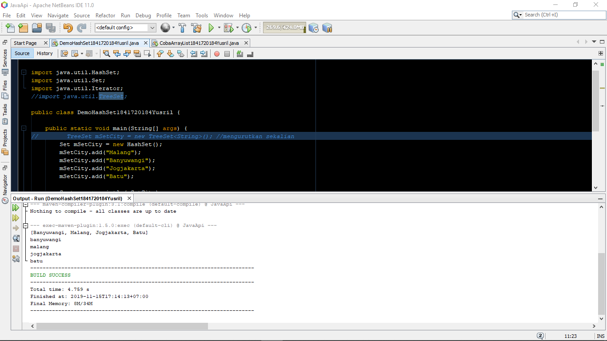
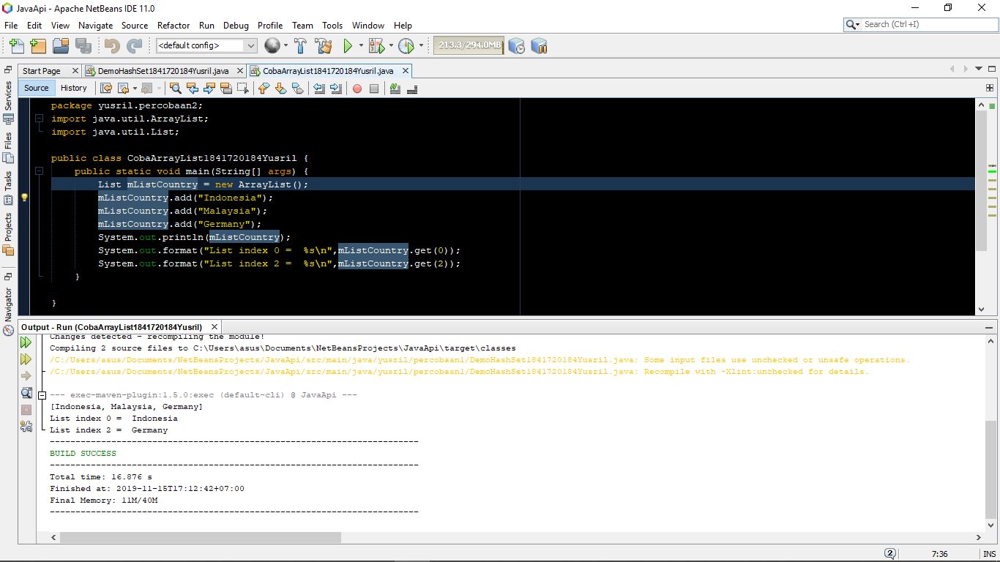
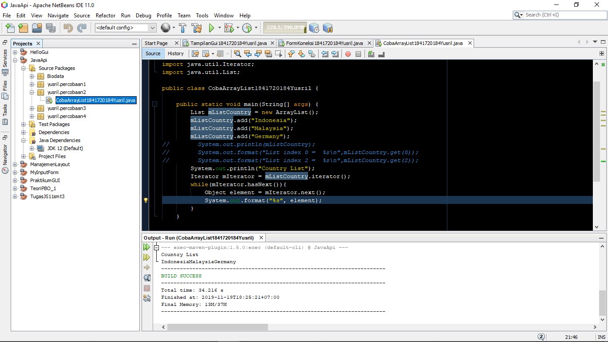
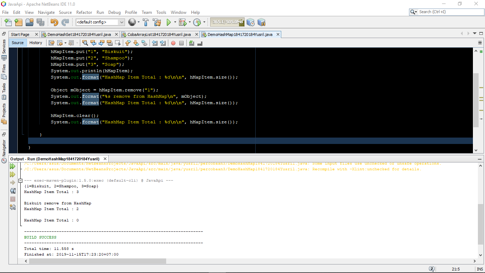
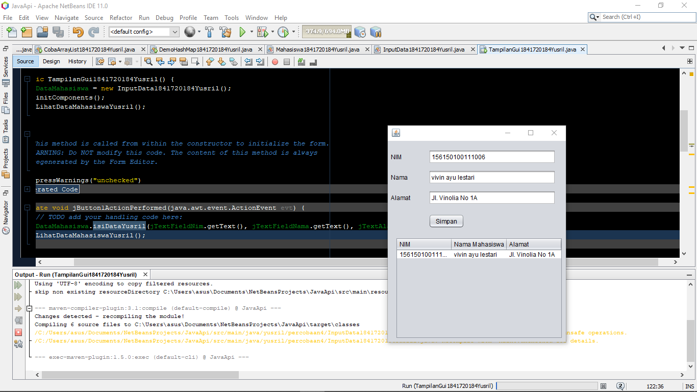
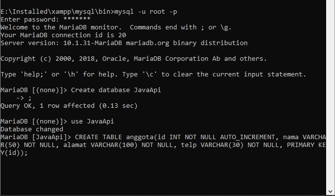
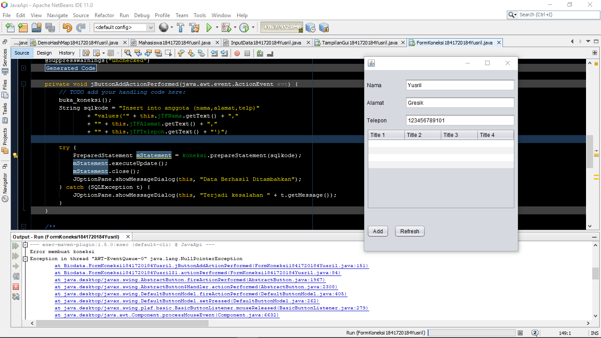
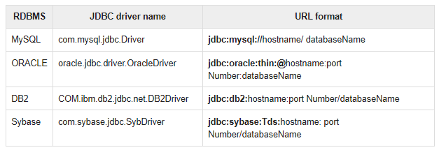
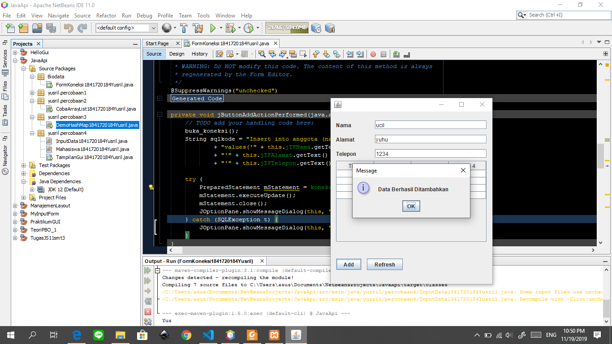
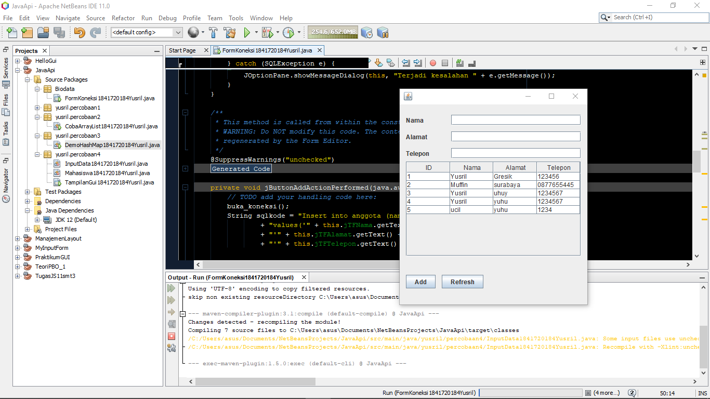

# Laporan Praktikum #12 - GUI

## Kompetensi
* Memahami cara penyimpanan objek menggunakan Collection dan Map.
* Mengetahui pengelompokan dari Collection.
* Mengetahui perbedaan dari interface Set, List dan Map.
* Mengetahui penggunaan class-class dari interface Set, List, dan Map.
* Memahami koneksi database menggunakan JDBC dan JDBC API

## Ringkasan Materi

Collection adalah sebuah objek yang digunakan untuk menyimpan sekumpulan objek. Bisa berupa objek yang berbeda beda tipe data. Terdapat tiga macam collection, yaitu **Set**,**List** dan **Map**. Untuk **Collection Set** objeknya harus bersifat unik, dengan kata lain harus berbeda satu sama lain. Jika ada yang sama maka ketika dimunculkan hanya salah satu yang dimunculkan. Untuk **Collection List**  bisa menerima duplikat. Cara penyimpanannya seperti array namun Array. dan untuk **Collection Map** dia menyimpan seperti array juga hanya saja memanfaatkan key dan value.

Ada juga untuk penerapan API memanfaatkan JDBC API (Java Database Connectivity API). Beberapa fungsi dari JDBC adalah: 
- Membangun koneksi antara aplikasi Java dan database
- Membangun dan mengeksekusi query
- Memproses hasil

## Praktikum
### Percobaan 1
Untuk percobaan ini melakukan percobaan mengenai HashSet, yaitu penampungan nilai yang berbeda tipe data dan tidak berduplikat. Saya juga mencoba menjalankan perintah TreeSet pada percobaan ini, hasilnya untuk pemunculan data pada TreeSet tampil secara terurut.

#### Pertanyaan
1. Fungsi _import java.util.*_ adalah meng-*import* library java.util yang kemudian bisa mengimplementasikan method atau method yang bisa diakses dari library tersebut.

2. Pada kode program `Set mSetCity = new HashSet();`

3. Untuk menambahkan objek pada HashSet yang objek tersebut bernama **Malang**, **Banyuwangi**, **Jogjakarta**, dan **Batu**.

4. Terjadi error karena objek dipanggil (`set`) belum diinstansiasi.

5. berfungsi untuk melakukan operasi perulangan akan tetapi targetnya untuk yang dinamis.

#### Kode Program

- [Hash Set](../../src/12_Java_API/yusril/percobaan1/DemoHashSet1841720184Yusril.java)

### Percobaan 2
percobaan kedua adalah melakukan eksperimen tentang ArrayList. ArrayList sendiri merupakan List yang berbentuk seperti Array akan tetapi dia berisi objek yang bermacam - macam tipedata dan bisa memiliki lebih dari satu objek bertipedata sama. 

#### Pertanyaan
1. Kode program `System.out.println(mListCountry);
System.out.format("List index 0 = %s\n", mListCountry.get(0));
System.out.format("List index 2 = %s\n", mListCountry.get(2));`

berfungsi untuk menampilkan objek dari ArrayList yang sudah terisi dan memanggil objek pada indeks ke-i, dimana i adalah indeks yang dituju

2. 

3. untuk kode program pertama menampilkan array listnya yang sedang berisi atau tidak berisi objek, sedangkan kode program kedua berfungsi untuk menampilkan isi dari array list tersebut jika memiliki isi, dan himpunan kosong jika tidak terdapat objek

#### Kode Program

- [Array List](../../src/12_Java_API/yusril/percobaan2/CobaArrayList1841720184Yusril.java)

### Percobaan 3
percobaan ketiga adalah melakukan percobaan terhadap Collection Map. Yang disini Collection Map sendiri memiliki _key_ dan *value* dalam operasinya. Key merupakan penanda dari objek yang akan dimasukkan, ditampilkan atau diambil valuenya

#### Pertanyaan
1. Kode program `hMapItem.put("1","Biskuit")` berfungsi untuk memasukkan *key* **1** yang ber-*value* **Biskuit**

2. Kode program `hMapItem.size()` berfungsi untuk mengambil panjang/ jumlah object yang terdapat di dalam Collection HashMap.

3. Kode program `hMapItem.remove("1")` berfungsi untuk menghapus object yang memiliki *key* bernilai **1**

4. Kode program `hMapItem.clear()` berfungsi untuk menghapus semua objek yang ada di dalam HashMap.

5. 

setelah dimasukkan kodenya

6. 

setelah dijalankan

7. Perbedaannya adalah kode program terbaru memunculkan objek/ valuenya saja tanpa menampilkan *key*nya seperti kode program yang pertama tadi.

#### Kode Program

- [Hash Map](../../src/12_Java_API/yusril/percobaan3/DemoHashMap1841720184Yusril.java)

### Percobaan 4

Pada percobaan kali ini melakukan implementasi ArrayList dalam GUI. Untuk perintahnya sendiri bisa membuat data masuk ke dalam tabel pada GUI.

#### Kode Program
- [Input Data](../../src/12_Java_API/yusril/percobaan4/InputData1841720184Yusril.java)
- [Mahasiswa](../../src/12_Java_API/yusril/percobaan4/Mahasiswa1841720184Yusril.java)
- [Tampilan GUI Form](../../src/12_Java_API/yusril/percobaan1/TampilanGui1841720184Yusril.java)
- [Tampilan GUI](../../src/12_Java_API/yusril/percobaan1/TampilanGui1841720184Yusril.java)

### Percobaan 5
Percobaan terakhir memanfaatkan koneksi MySQL terhadap java. Sehingga database yang berada pada MySQL bisa diakses oleh java.

pertama buat database terlebih dahulu:

Hasil :

terjadi error dengan pesan `NullPointerException` karena pada database yang dipanggil tidak sesuai dengan lokasi database ketika data ditambah. Hal itu menyebabkan tidak adanya objek pada database yang dituju oleh java. Sehingga perlu diubah menjadi nama database yang terdapat tabel `anggota` di dalamnya. Database saya kebetulan saya beri nama **javaapi** sehingga ketika mengikuti modul akan terjadi error.

list aturan penulisan url:

Hasil perbaikan : 

- maksud source code insert data diatas : 
    
    - sqlkode = query sql untuk menambah data pada tabel database yang akan dieksekusi pada java

    - di dalam try terdapat objek `mStatement` bertipe data **PreparedStatement** yang berfungsi untuk menerima inputan saat runtime. (kebalikan dari **Statement**)

Hasil setelah penambahan method ambil_data_tabel():

- alur method ambil_data_tabel():
    1. JDBC melakukan konseksi dengan MySQL
    2. Melakukan inisiasi **Statement** untuk menampung query sql nantinya
    3. Membuat query sql `SELECT * FROM anggota`, berfungsi untuk menampilkan seluruh data pada database
    4. Kemudian query dieksekusi dengan **ResultSet**
    5. pada operasi perulangan dilakukan konversi data menuju String dan memasukkannya ke dalam tabel Form
    6. Setelah operasi pada try sudah tereksekusi semua maka dilakukan perintah **Statement** dan **ResultSet** dinonaktifkan

- perintah untuk tombol refresh:
`private void jButtonRefreshActionPerformed(java.awt.event.ActionEvent evt) {                            ambil_data_tabel();}`

### Kode Program
- [Form Koneksi (Form)](../../src/12_Java_API/yusril/FormKoneksi1841720184Yusril.form)
- [Form Koneksi (Java)](../../src/12_Java_API/yusril/FormKoneksi1841720184Yusril.java)

## Kesimpulan

Dengan Java API, kita bisa memanfaatkan beberapa library yang membantu pekerjaan kita, seperti untuk pemanggilan library Collection dan juga penyambungan dengan database menggunakan JDBC.

## Pernyataan Diri

Saya menyatakan isi tugas, kode program, dan laporan praktikum ini dibuat oleh saya sendiri. Saya tidak melakukan plagiasi, kecurangan, menyalin/menggandakan milik orang lain.

Jika saya melakukan plagiasi, kecurangan, atau melanggar hak kekayaan intelektual, saya siap untuk mendapat sanksi atau hukuman sesuai peraturan perundang-undangan yang berlaku.

Ttd,

***Muhammad Yusril Hasriansyah***