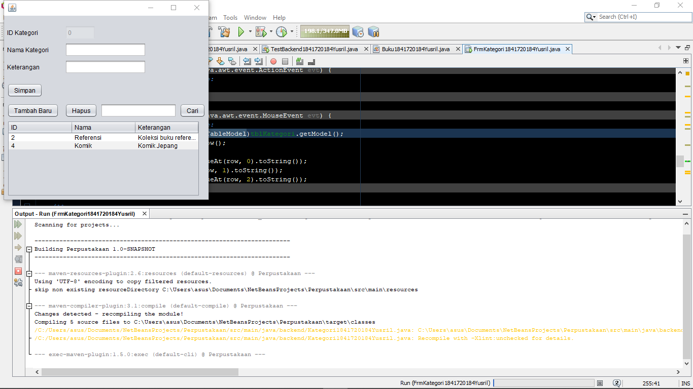

# Laporan Praktikum #14 - GUI dan Database

## Kompetensi
* Menggunakan paradigma berorientasi objek untuk interaksi dengan database
* Membuat backend dan frontend
* Membuat form sebagai frontend

## Ringkasan Materi

Pada modul kali ini kita akan mempelajari tentang hubungan GUI dan Database. Dimana GUI ini akan bisa mengakses database yang telah dibuat nantinya tetu saja dengan menggunakan beberapa Library yang telah dipelajari seperti, **JDBC**,**ArrayList**, dan **Swing**.

## Praktikum
### Percobaan 1

Pada percobaan ini saya diperintahkan untuk membuat database **dbperpus** dan berisi 4 tabel, yaitu **kategori**, **buku**, **anggota**, dan **peminjaman**. Saya disini menggunakan *command prompt* karena selain melatih dasar tentang MySQL juga meringankan kinerja laptop :D

- pembuatan database:

- pembuatan 4 tabel:

- menunjukkan tabel:

### Percobaan 2
#### Kode Program

Pada percobaan ini saya diperintahkan untuk membuat package **frontend** dan **backend**.

### Percobaan 3
Pada percobaan kali ini akan membuat class yang berisi method untuk melakukan koneksi kepada database MySQL.

#### Kode Program

- [DB Helper](../../src/14_GUI_dan_Database/backend/DBHelper1841720184Yusril.java)

### Percobaan 4

pada percobaan ini akan membuat class untuk menghandle CRUD (Create, Read, Update, Delete) pada tabel kategori di database dbperpus

#### Kode Program

- [Kategori](../../src/14_GUI_dan_Database/frontend/Kategori1841720184Yusril.java)

### Percobaan 5
Pada percobaan ini hanya untuk mengetes percobaan sebelumnya apakah datanya bisa masuk ke dalam database atau tidak.

### Kode Program
- [Test Backend](../../src/14_GUI_dan_Database/frontend/TestBackend1841720184Yusril.java)

### Percobaan 6
percobaan ini membuat form yang mengimplementasikan kinerja TestBackend namun menggunakan GUI dan pembuatan class Anggota.

Memasukkan data:

Menghapus data:

Mencari data:

Anggota (backend):

### Kode Program
- [FrmKategori java](../../src/14_GUI_dan_Database/frontend/FrmKategori1841720184Yusril.java)
- [FrmKategori form](../../src/14_GUI_dan_Database/frontend/FrmKategori1841720184Yusril.form)
- [Backend Anggota](../../src/14_GUI_dan_Database/backend/Anggota1841720184Yusril.java)

### Percobaan 7
Kali ini membuat form yang sama seperti Kategori tetapi sekarang diperuntukkan tabel Anggota dan juga pembuatan class buku di package backend.

### Kode Program
- [Anggota Form](../../src/14_GUI_dan_Database/frontend/FrmAnggota1841720184Yusril.form)
- [Anggota Java](../../src/14_GUI_dan_Database/frontend/FrmAnggota1841720184Yusril.java)
- [Backend Buku](../../src/14_GUI_dan_Database/backend/Buku1841720184Yusril.java)

### Percobaan 8
percobaan ini akan membuat GUI untuk membantu user agar bisa berinteraksi dengan database, yaitu mengambil, memasukkan dan menghapus data dari database.

### Kode Program
- [Buku Form](../../src/14_GUI_dan_Database/frontend/FrmBuku1841720184Yusril.form)
- [Buku Java](../../src/14_GUI_dan_Database/frontend/FrmBuku1841720184Yusril.java)

## Tugas
Membuat seperti tiga class sebelumnya tetapi kali ini untuk tabel peminjaman.

### Kode Program
- [Peminjaman Form](../../src/14_GUI_dan_Database/frontend/FrmPeminjaman1841720184Yusril.form)
- [Peminjaman Java](../../src/14_GUI_dan_Database/frontend/FrmPeminjaman1841720184Yusril.java)
- [Peminjaman Backend](../../src/14_GUI_dan_Database/backend/Peminjaman1841720184Yusril.java)

## Kesimpulan

Dengan memanfaatkan GUI, kita bisa lebih mudah mengakses database. Sehingga tidak perlu lagi membuat mata sakit karena melihat CLI yang begitu rumit dan tidak user-friendly. Selain itu, bisa membuat produk menjadi lebih menarik, uhuy.

## Pernyataan Diri

Saya menyatakan isi tugas, kode program, dan laporan praktikum ini dibuat oleh saya sendiri. Saya tidak melakukan plagiasi, kecurangan, menyalin/menggandakan milik orang lain.

Jika saya melakukan plagiasi, kecurangan, atau melanggar hak kekayaan intelektual, saya siap untuk mendapat sanksi atau hukuman sesuai peraturan perundang-undangan yang berlaku.

Ttd,

***Muhammad Yusril Hasriansyah***