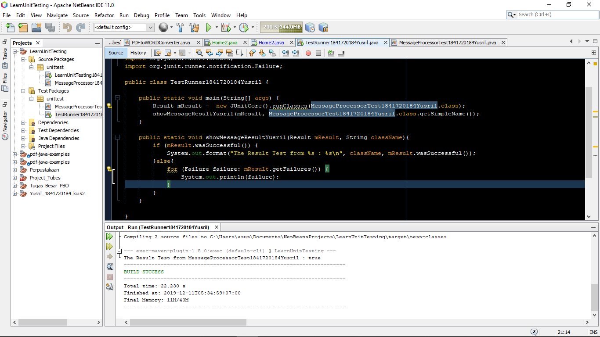
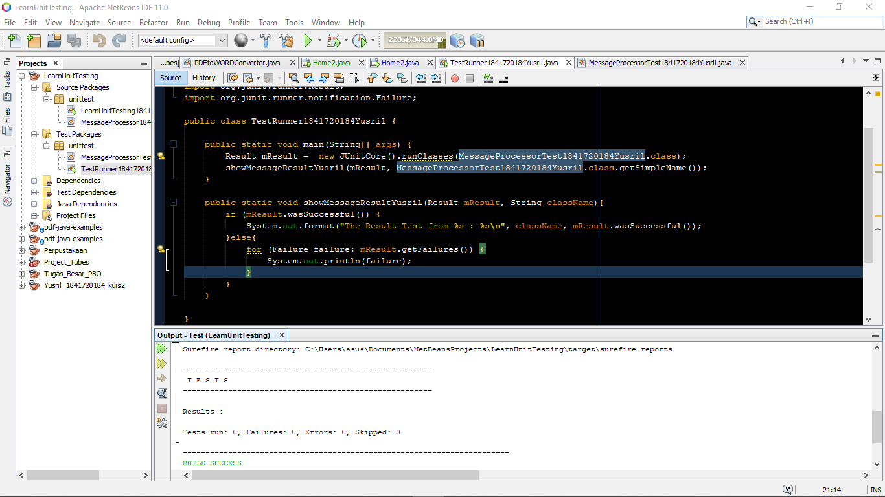
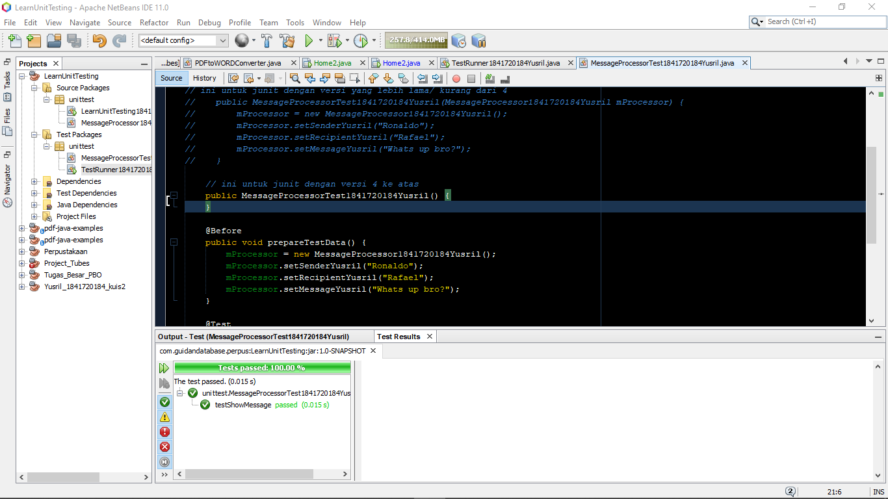
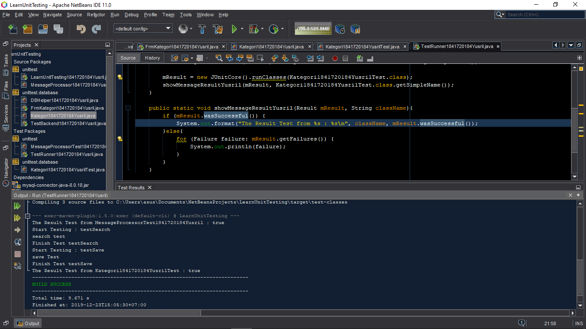
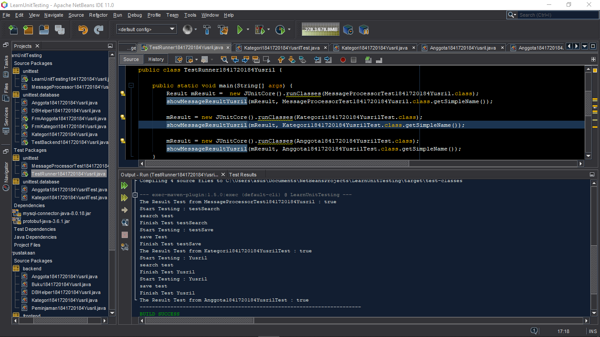

# Laporan Praktikum #15 - Unit Testing

## Kompetensi
1. Memahami konsep dan fungsi unit testing
2. Menerapkan unit testing dengan JUnit pada program sederhana.
3. Menerapkan unit testing dengan JUnit pada progam yang terkoneksi database

## Ringkasan Materi

Materi kali ini membahas tentnag Unit Testing, yaitu melakukan pemeriksaan pada aplikasi apakah terdapat error atau tidak. Saya sebenarnya setelah melakukan testing ini masih sedikit belum paham tentang testing, terutama pada percobaan 1 yang saya coba sempat terjadi error. Disitu saya sempat malas mengerjakan sehinga terjadi molor seperti ini.

## Praktikum
### Percobaan 1

Pada percobaan pertama ini saya diperintahkan untuk melakukan testing menggunakan class baru yang bernama **MessageProcessor** dan **LearnUnitTesting**. Untuk 2 class itu tadi merupakan proses simulasi sederhana dari testing secara manual di _Source Packages_. 
Kemudian setelah itu baru dilakukan testing yang sebenarnya di _Test Packages_. Percobaan ini memanfaatkan JUnitCore saja.

- Hasil :

- Test :

- Test Window :

#### Kode Program
- [Message Processor](../../src/15_Unit_Testing/unittest/MessageProcessor1841720184Yusril.java)

- [Message Processor Test](../../src/15_Unit_Testing/test/unittest/MessageProcessorTest1841720184Yusril.java)

- [Learn Unit Testing](../../src/15_Unit_Testing/unittest/LearnUnitTesting1841720184Yusril.java)

- [Test Runner](../../src/15_Unit_Testing/test/unittest/TestRunner1841720184Yusril.java)

### Percobaan 2

Pada percobaan kedua melakukan testing juga akan tetapi dengan memanfaatkan TestCase (meng*extends* TestCase). Percobaan ini memanfaatkan class **Kategori** pada jobsheet sebelumnya (jobsheet 14 - GUI and Database). Selain class **Kategori**, juga terdapat class **DB Helper** untuk membantu koneksi dengan database.

Hasil : 

#### Kode Program

- [Kategori](../../src/15_Unit_Testing/unittest/database/Kategori1841720184Yusril.java)

- [DB Helper](../../src/15_Unit_Testing/unittest/database/DBHelper1841720184Yusril.java)

- [Test Backend](../../src/15_Unit_Testing/unittest/database/TestBackend1841720184Yusril.java)

- [Test Runner](../../src/15_Unit_Testing/test/unittest/TestRunner1841720184Yusril.java)

- [Kategori Test](../../src/15_Unit_Testing/test/unittest/database/Kategori1841720184YusrilTest.java)

## Tugas
Tugas pada jobsheet ini merupakan kelanjutan dari percobaan 2 yaitu melakukan testing pada class lain selain class **Kategori**. Saya disini melakukan testing pada class **Anggota** karena sedikit lebih mudah menurut saya daripada class lainnya.

Hasil:

### Kode Program
- [Anggota](../../src/15_Unit_Testing/unittest/database/Anggota1841720184Yusril.java)

- [DB Helper](../../src/15_Unit_Testing/unittest/database/DBHelper1841720184Yusril.java)

- [Test Backend](../../src/15_Unit_Testing/unittest/database/TestBackend1841720184Yusril.java)

- [Test Runner](../../src/15_Unit_Testing/test/unittest/TestRunner1841720184Yusril.java)

- [Anggota Test](../../src/15_Unit_Testing/test/unittest/database/Anggota1841720184YusrilTest.java)

## Kesimpulan

Unit Testing berguna untuk melakukan pemeriksaan terhadap error sebelum aplikasi dipasarkan ke masyarakat. Untuk meminimalisir terjadinya error dari user, sehingga harus dilakukan testing terlebih dahulu agar bisa diperbaiki dengan cepat jika terjadi error.

## Pernyataan Diri

Saya menyatakan isi tugas, kode program, dan laporan praktikum ini dibuat oleh saya sendiri. Saya tidak melakukan plagiasi, kecurangan, menyalin/menggandakan milik orang lain.

Jika saya melakukan plagiasi, kecurangan, atau melanggar hak kekayaan intelektual, saya siap untuk mendapat sanksi atau hukuman sesuai peraturan perundang-undangan yang berlaku.

Ttd,

***Muhammad Yusril Hasriansyah***