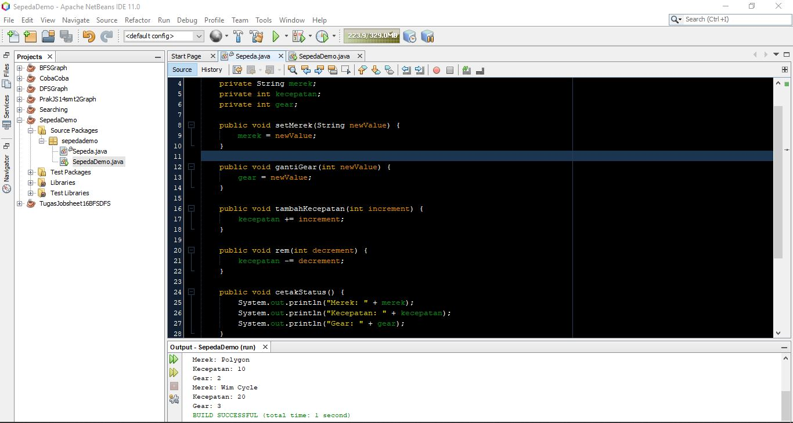
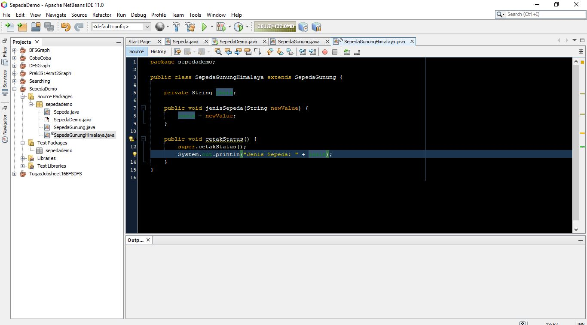

# Laporan Praktikum #1 - Pengantar Konsep PBO

## Kompetensi

1. Perbedaan paradigma berorientasi objek dengan paradigma struktural
2. Konsep dasar PBO

## Ringkasan Materi

Untuk keseluruhan dalam menyelesaikan problem yang diberikan dosen tidak ada masalah karena pada saat semester pertama sudah dijelaskan sedikit tentang OOP atau PBO. , hanya saat berhubungan dengan github saya agak bingung karena baru pertama kali mengoperasikannya.

## Percobaan

### Percobaan 1

Percobaan pertama ini menerapkan konsep pbo paling sederhana. Terdapat atribut yang terenkapsulasi secara private. namun untuk methodnya public semua.

link kode program Sepeda: [this link](../../src/1_Pengantar_Konsep_PBO/sepedademo/Sepeda1841720184Yusril.java)

link kode program Main : [this link](../../src/1_Pengantar_Konsep_PBO/sepedademo/SepedaDemo1841720184Yusril.java)
### Percobaan 2

pada percobaan kali ini keseluruhan kode program sama dengan percobaan pertama, hanya saja ditambah dengan penerapan aspek inheritance.

link kode program Sepeda Gunung: [this link](../../src/1_Pengantar_Konsep_PBO/sepedademo/SepedaGunung1841720184Yusril.java)

link kode program Sepeda Gunung Main: [this link](../../src/1_Pengantar_Konsep_PBO/sepedademo/SepedaDemo1841720184Yusril.java)

### Percobaan Tambahan

Saya mencoba double extend untuk SepedaGunung dengan membuat SepedaGunungHimalaya sebagai turunan/inherit dari SepedaGunung

Untuk percobaan pertama ini memunculkan error dan mengharuskan membuat file di package `Test Packages`

Untuk percobaan kedua ini baru berhasil, karena saya hanya extend object yang sebelumnya sudah extend object induk. untuk pemanggilan dari inherit terakhir ke induk sama dengan pemanggilan inherit pertama ke induk, yaitu dengan super.

## Pertanyaan

1.  - Object : Suatu rangkaian dalam program yang terdiri dari **state** dan **behaviour**
    - Class : blueprint atau prototype dari objek.
    - Enkapsulasi (information-hiding) : menyembunyikan informasi / source-code yang tidak perlu kita ketahui.
    - Inheritance (pewarisan) : aspek untuk mengambil **state** dan atau **behaviour** yang dimiliki objek induk untuk digunakan oleh object tersebut 
    - Polimorfisme : Pengambilan **state** dan atau **behaviour** dari class induk kemudian memodifikasinya di dalam objek itu sesuai kebutuhan.

2. Object adalah class yang sudah diisi dengan atribut dan method sehingga bisa dijalankan. Seangkan class merupakan blueprint dari object dengan kata lain masih berupa wadah yang masih kosong.

3. PBO bersifat fleksibel dan modular, yang artinya jika ada perubahan fitur dalam program maka bisa dipastikan keseluruhan program akan terganggu, mungkin hanya beberapa kode program yang berhubungan dengan fitur ter sebut yang diganti. Sedangkan untuk struktural jika ada perubahan fitur maka harus mengubah semua dari awal.

4. ada atribut :
    - merek
    - kecepatan
    - gear

5. Screenshot tambah method warna

## Tugas

Saya membuat objek wisata berisikan 2 jenis wisata, yaitu pantai dan gunung.
masing- masing wisata memiliki harga tiket masuk(htm) berbeda dan dicetak pada struk/ tanda terima bersamaan dengan jenis wisatanya.

Kedua wisata memiliki atribut nama lokasi wisata masing-masing. 

Ini link screenshot 1: [Link ini](../../src/1_Pengantar_Konsep_PBO/tugas/WisataMain1841720184Yusril.java)

Ini link screenshot 2: [Link ini](../../src/1_Pengantar_Konsep_PBO/tugas/Wisata1841720184Yusril.java)

Ini link screenshot 3: [Link ini](../../src/1_Pengantar_Konsep_PBO/tugas/Pantai1841720184Yusril.java)

Ini link screenshot 4: [Link ini](../../src/1_Pengantar_Konsep_PBO/tugas/Gunung1841720184Yusril.java)

## Kesimpulan

Pemrograman menggunakan PBO lebih memudahkan developer dalam membuat dan memanipulasi dalam memrogram, apalagi jika program tersebut termasuk project besar. Jika ada salah dalam salah satu fitur, tidak perlu mengubah keseluruhan program, cukup fitur yang salah tadi yang diganti

## Pernyataan Diri

Saya menyatakan isi tugas, kode program, dan laporan praktikum ini dibuat oleh saya sendiri. Saya tidak melakukan plagiasi, kecurangan, menyalin/menggandakan milik orang lain.

Jika saya melakukan plagiasi, kecurangan, atau melanggar hak kekayaan intelektual, saya siap untuk mendapat sanksi atau hukuman sesuai peraturan perundang-undangan yang berlaku.

Ttd,

***Muhammad Yusril Hasriansyah***