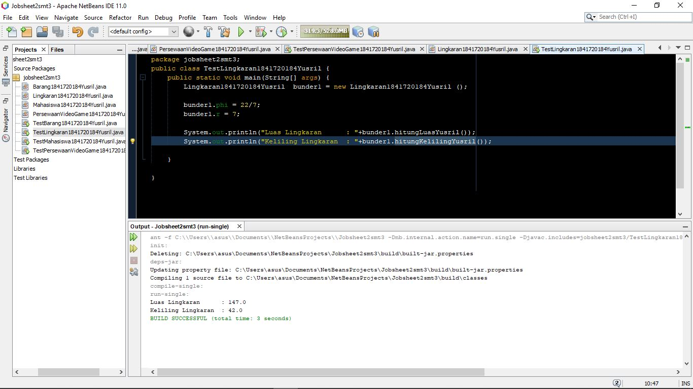

# Laporan Praktikum #2 - Class and Object

## Kompetensi

- Mahasiswa dapat memahami deskripsi dari class dan object
- Mahasiswa memahami implementasi dari class
- Mahasiswa dapat memahami implementasi dari attribute
- Mahasiswa dapat memahami implementasi dari method
- Mahasiswa dapat memahami implementasi dari proses instansiasi
- Mahasiswa dapat memahami implementasi dari try-catch
- Mahasiswa dapat memahami proses pemodelan class diagram menggunakan UML

## Ringkasan Materi

Materi kali ini masih mirip dengan yang pertama kemarin, sejauh ini belum megalami kesulitan karena sudah sering mencobanya waktu tahun pertama kuliah dulu

## Percobaan

### Percobaan 1

1. 
2. Mahasiswa dan Manager
3. attribut dan tipedata:
    - id (integer)
    - nama (String)
    - jenisKelamin (String)
    - jabatan (String)
    - gaji (integer)
4. method :
    - printDataPribadi()
    - printGaji()

### Percobaan 2

link kode program Mahasiswa: [Mahasiswa](../../src/2_Class_dan_Object/Mahasiswa1841720184Yusril.java)

link kode program Mahasiswa Main: [this link](../../src/2_Class_dan_Object/TestMahasiswa1841720184Yusril.java)

7. public int nim;
    public String nama;
    public String alamat;
    public String kelas;

8. public void tampilBiodataYusril() {
        System.out.println("Nim     : "+nim);
        System.out.println("Nama    : "+nama);
        System.out.println("Alamat  : "+alamat);
        System.out.println("Kelas   : "+kelas);
    }

9. sebanyak 1 objek yang diinstasiasi

10. memasukkan data '101' ke dalam attribut nim
11. Memanggil method tampilBiodata() yang prosesnya berisi syntax untuk menampilkan data
12. 

### Percobaan 3

[Main Program](../../src/2_Class_dan_Object/TestBarang1841720184Yusril.java)

  [Bukan Main Program](../../src/2_Class_dan_Object/Barang1841720184Yusril.java)

- fungsi argumen = untuk menambahkan data baru dengan memanfaatkan parameter

- return berfungsi untuk mengembalikan nilai pada method tersebut. Penggunaan return harus pada saat method menggunakan tipe data selain void.

## Tugas
1. 

2. ini hasil program dari nomor 1:

link ke kode program : 
 [Main Program](../../src/2_Class_dan_Object/TestPersewaanVideoGame1841720184Yusril.java)

  [Bukan Main Program](../../src/2_Class_dan_Object/PersewaanVideoGame1841720184Yusril.java)

3. Tugas Class Lingkaran

link ke kode program : 
 [Main Program](../../src/2_Class_dan_Object/TestLingkaran1841720184Yusril.java)

  [Bukan Main Program](../../src/2_Class_dan_Object/Lingkaran1841720184Yusril.java)

4. Tugas Class Barang

link ke kode program : 
 [Main Program](../../src/2_Class_dan_Object/TestTugasBarang1841720184Yusril.java)

  [Bukan Main Program](../../src/2_Class_dan_Object/TugasBarang1841720184Yusril.java)

## Kesimpulan

Pemrograman menggunakan PBO lebih memudahkan developer dalam membuat dan memanipulasi dalam memrogram, scriptnya juga lebih sedikit ketimbang _procedural programming_ apalagi jika program tersebut termasuk project besar. Jika ada salah dalam salah satu fitur, tidak perlu mengubah keseluruhan program, cukup fitur yang salah tadi yang diganti

## Pernyataan Diri

Saya menyatakan isi tugas, kode program, dan laporan praktikum ini dibuat oleh saya sendiri. Saya tidak melakukan plagiasi, kecurangan, menyalin/menggandakan milik orang lain.

Jika saya melakukan plagiasi, kecurangan, atau melanggar hak kekayaan intelektual, saya siap untuk mendapat sanksi atau hukuman sesuai peraturan perundang-undangan yang berlaku.

Ttd,

***Muhammad Yusril Hasriansyah***
