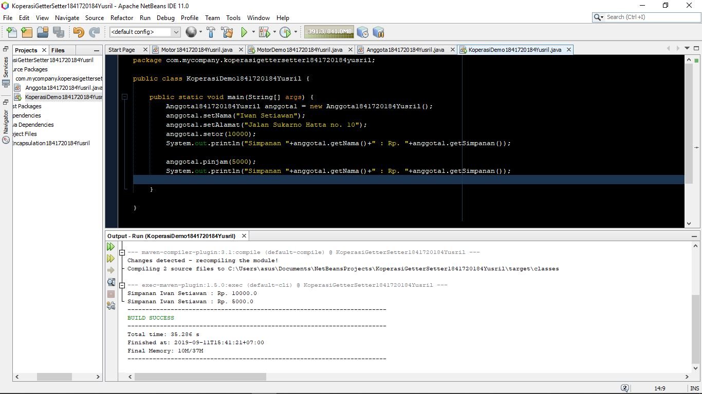

# Laporan Praktikum #3 - Pengantar Konsep PBO

## Kompetensi
Setelah melakukan percobaan pada modul ini, mahasiswa memahami konsep:
1. Konstruktor
2. Akses Modifier
3. Atribut/method pada class
4. Intansiasi atribut/method
5. Setter dan getter
6. Memahami notasi pada UML Class Diagram

## Ringkasan Materi

Materi enkapsulasi digunakan untuk membuat kode program lebih mudah dipahami oleh user. Karena user tidak perlu mengetahui proses dari method yang telah dia panggil dengan catatan method tersebut berhasil dijalankan.

## Percobaan

### Percobaan 1

1. berikut adalah uml motor dari kode program saya

2. berikut hasil screenshot percobaan motor dari modul:

 

untuk kode programnya akan saya cantumkan di pertanyaan nomor 3 pada percobaan 2, karena dalam percobaan 2 ada sedikit modifikasi dari kode program percobaan 1

### Percobaan 2

 

Pada percobaan kedua ini terdapat beberapa perubahan pada _access modifier_ pada atribut dan penambahan beberapa method tujuannya 

#### Pertanyaan (Percobaan 1 dan 2)

1. Karena pada saat itu belum dimunculkan perintah untuk menyalakan mesin, sedangkan perintah untuk menambah kecepatan sudah dipanggil. Padahal untuk menambah kecepatan, mesin harus dalam posisi ON, karena itu merupakan syarat untuk menambah kecepatan.

2. Agar pada class main tidak muncul atribut tersebut di dalam list rekomendasi atribut dan method yang dipanggil saat melakukan pemanggilan. Sehingga tidak membingungkan user.

3.  
Kode yang dimodifikasi
________________________________________________________
public void tambahKecepatanYusril() {
        if (kontakOn == true) {
            if (kecepatan <= 100 && kecepatan >= 0) {
                kecepatan += 5;
            } else {
                System.out.println("Anda sudah melewati kecepatan 100. Jangan ngebut, nanti benjut!");
            }
        } else {
            System.out.println("Kecepatan tidak bisa bertambah karena mesin off");
        }
    }
________________________________________________________

Main program: 
[link main](../../src/3_Enkapsulasi/MotorDemo1841720184Yusril.java)

Non-Main Program: 
[link bukan main](../../src/3_Enkapsulasi/Motor1841720184Yusril.java)

### Percobaan 3

pada percobaan ini saya disuruh membuat method untuk memasukkan dan mengambil data yaitu setter dan getter.

untuk link kode program mengikuti percobaan 4, karena sudah termodifikasi.

### Percobaan 4

pada percobaan ini saya hanya disuruh melakukan modifikasi terhadap kode program pada percobaan 3, yaitu dengan menambahkan konstruktor dan melakukan pengisian data saat instansiasi.

Main Program: [link kode main](../../src/3_Enkapsulasi/KoperasiDemo1841720184Yusril.java)

Bukan Main Program: [link kode bukan main](../../src/3_Enkapsulasi/Anggota1841720184Yusril.java)

#### Pertanyaan (Percobaan 3 dan 4)

1. yang dimaksud dengan setter adalah method yang digunakan untuk memasukkan data, sedangkan getter berfungsi sebaliknya, yaitu mengambil data untuk ditampilkan atau digunakna pada method lain.

2. untuk mengambil data pada atribut simpanan yang sudah diinisialisasi.

3. method public void setor(float uang);

4. method yang namanya sama persis dengan nama class, biasanya digunakan untuk memasukkan data pada saat instansiasi berlangsung. Namun juga terdapat konstruktor kosong/ tanpa data, fungsinya untuk menghilangkan error ketika kita tidak mengisikan data pada saat instansiasi. Untuk jumlah  konstruktor beragam, sesuai kebutuhan yang diinginkan programmer.

5. 
    - nama konstruktor harus dama dengan nama class
    - jika programmer tidak ingin data terisi pada saat instansiasi, maka dia harus menambahkan konstruktor _default_ atau tanpa data agar tidak terjadi error saat debugging/run program.

6. boleh saja, tetapi konstruktor tidak akan bisa diakses dari luar class tersebut.

bukti: 

7. pada saat konstruktor sudah di inisialisasi.

8. perbedaannya adalah atribut class bisa digunakan untuk seluruh class yang sudah diinstansiasi menjadi objek, sedangkan instansiasi atribut adalah atribut yang hanya bisa digunakan oleh oleh objek itu sendiri.

9. sama seperti perbedaan atribut class dengan instansiasi atribut diatas, hanya saja kali ini berhubungan dengan method. 

## Kesimpulan

Dengan menggunakan metode enkapsulasi, kita bisa mengatur mana atribut atau method yang akan tampil pada main class sehingga tidak menimbulkan kerancuan atau kebingungan pada saat mengeksekusi program sekaligus mengantisipasi error jika ada kode program yang bertumpuk karena kita sudah menamai semua method dan atribut sesuai keinginan.

## Tugas
    
  1. 
  
  

  Link ke kode program: 

   i. [Main Program](../../src/3_Enkapsulasi/EncapTest1841720184Yusril.java)

   ii. [Bukan Main Program](../../src/3_Enkapsulasi/EncapDemo1841720184Yusril.java)

  2. 
  
     public void setAge(int newAge){  
        if (newAge > 30) {
            age = 30;
        }else{
            age = newAge;
        }
    }
   pada kode program di atas terdapat sebuah perintah dalam pemilihan, jika input umur yang dimasukkan lebih dari 30 maka umur tersebut akan di*set* menjadi 30 sedangkan jika input dimasukkan dibawah 30 maka umurnya akan sesuai dengan inputan yang dimasukkan. Dalam kasus kali ini, umur diinputkan sebesar 35, maka sesuai kode progra diatas maka umur akan di*set* 30 sehingga yang muncul nantinya adalah angka 30.

   3. kode program yang sudah dimodifikasi:

    public void setAge(int newAge) {
        if (newAge <= 30 && newAge >= 18) {
            if (newAge > 30) {
                age = 30;
            } else {
                age = newAge;
            }
        } else if (newAge > 0 && newAge < 18) {
            System.out.println("Umur anda saat ini berada dibawah batas umur!");
        } else if (newAge > 30) {
            System.out.println("Umur anda sudah melebihi batas!");
        } else {
            System.out.println("Maaf inputan anda salah!");
        }
    }

Link ke kode program:

[Main link](../../src/3_Enkapsulasi/EncapTest1841720184Yusril.java)

[Bukan Main link](../../src/3_Enkapsulasi/EncapDemo1841720184Yusril.java)

   4. 

   
   
   5. Modifikasi method angsur soal no.4:
       
            public void angsur(int pinjaman) {
            double angsuran = 0.1 * this.pinjaman;

                if (pinjaman >= angsuran) {
                    this.pinjaman -= pinjaman;
                } else {
                    System.out.println("Maaf, angsuran harus 10% dari jumlah pinjaman");
                }

            }

6. Ini bukti screenshot serta hasil modifikasi kode program tugas nomor 4:

Link kode program : [Main program](../../src/3_Enkapsulasi/TestKoperasi1841720184Yusril.java)

Link kode program : [bukan Main program](../../src/3_Enkapsulasi/AnggotaKoperasi1841720184Yusril.java)

## Pernyataan Diri

Saya menyatakan isi tugas, kode program, dan laporan praktikum ini dibuat oleh saya sendiri. Saya tidak melakukan plagiasi, kecurangan, menyalin/menggandakan milik orang lain.

Jika saya melakukan plagiasi, kecurangan, atau melanggar hak kekayaan intelektual, saya siap untuk mendapat sanksi atau hukuman sesuai peraturan perundang-undangan yang berlaku.

Ttd,

***Muhammad Yusril Hasriansyah***