# Laporan Praktikum #4 - Relasi Class

## Kompetensi
Setelah menempuh pokok bahasan ini, mahasiswa mampu:
1. Memahami konsep relasi kelas;
2. Mengimplementasikan relasi has‑a dalam program.

## Ringkasan Materi

Materi kali ini mempelajari kelanjutan dari Pemrograman Berbasis Objek yaitu bagaimana cara menghubungkan satu objek dengan objek lain.

## Percobaan

### Percobaan 1

Berikut adalah hasil screenshot dari percobaan pertama, yaitu merelasikan objek **Processor** dengan objek **Laptop** 

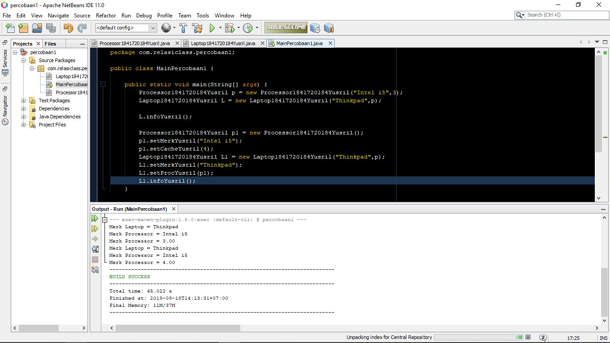

Link kode program:
- [Main Program](../../src/4_Relasi_Class/MainPercobaan11841720184Yusril.java)

- [Processor](../../src/4_Relasi_Class/Processor1841720184Yusril.java)

- [Laptop](../../src/4_Relasi_Class/Laptop1841720184Yusril.java)

#### Pertanyaan
1. method _setter_ berfungsi untuk memasukkan data ke dalam objek, sedangkan method _getter_ berfungsi untuk mengambil nilai dari dalam objek yang telah di*set* sebelumnya.
2. 
    - Konstruksi default : pada saat instansiasi objek, parameter tidak bisa atau tidak diisi data
    - Konstruksi berparameter : Pengisian datanya dilakukan pada saat instansiasi objek.
3. atribut _proc_ bertipe *object*. Karena nama dari tipe datanya sama dengan class yang hendak dijadikan objek.
4. pada baris
            
        private Processor1841720184Yusril proc;

    dan

        public Laptop1841720184Yusril(String merk, Processor1841720184Yusril proc) {
        this.merk = merk;
        this.proc = proc;
    }

5. gunanya untuk menampilkan data yang berada pada method info pada class Processor. Berikut adalah kode programnya

        public void infoYusril() {
        System.out.println("Merk Laptop = " + merk);
        proc.infoYusril();
        }

    berikut ini adalah isi dari method info:

        public void infoYusril(){
        System.out.printf("Merk Processor = %s\n", merk);
        System.out.printf("Merk Processor = %.2f\n", cache);
        }

6.  *p* adalah objek dari class Processor, jika 

        Laptop l = new Laptop("Thinkpad", p);
    diubah

        Laptop l = new Laptop("Thinkpad", new Processor("Intel i5", 3));

    tidak ada perubahan dari kedua kode program tersebut karena kode program kedua merupakan penjabaran dari instansiasi objek *p* pada kode program pertama.

### Percobaan 2

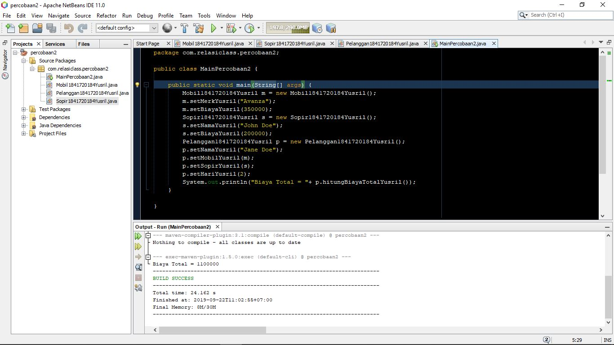 

 diatas adalah hasil kode program relasi untuk 3 objek yaitu **Pelanggan**, **Mobil**, dan **Sopir**

Link Kode Program:

- [Main Program](../../src/4_Relasi_Class/MainPercobaan21841720184Yusril.java)

- [Mobil](../../src/4_Relasi_Class/Mobil1841720184Yusril.java)

- [Sopir](../../src/4_Relasi_Class/Sopir1841720184Yusril.java)

- [Pelanggan](../../src/4_Relasi_Class/Pelanggan1841720184Yusril.java)

#### Pertanyaan

1. pada baris
        
        private Mobil1841720184Yusril mobil;
        private Sopir1841720184Yusril sopir;

dan

        public Mobil1841720184Yusril getMobil() {
        return mobil;
        }

        public void setMobilYusril(Mobil1841720184Yusril mobil) {
        this.mobil = mobil;
        }

        public Sopir1841720184Yusril getSopir() {
        return sopir;
        }

        public void setSopirYusril(Sopir1841720184Yusril sopir) {
        this.sopir = sopir;
        }

serta

        public int hitungBiayaTotalYusril(){
        return mobil.hitungBiayaMobilYusril(hari) + 
        sopir.hitungBiayaSopirYusril(hari);
        }

2. karena pada dunia nyata, menghitung biaya sewa harus dikalikan dengan lama meminjamnya yang formatnya biasanya berupa hari

3. Untuk memanggil method *hitungBiayaMobil* dan *hitungBiayaSopir* yang di dalamnya terdapat proses perhitungan berisi *biaya x hari* dan juga kedua method memiliki parameter sama yaitu hari bertipe data integer. Sehingga harus diisi sesuai dengan atribut yang dimaksud.

4. Untuk memasukkan nilai yang sudah dibuat oleh objek *m* dan *s* pada class main ke dalam class **Mobil** dan **Sopir** agar bisa ter*compile*.

berikut adalah hasil *execute* jika perintah tersebut dihapus : 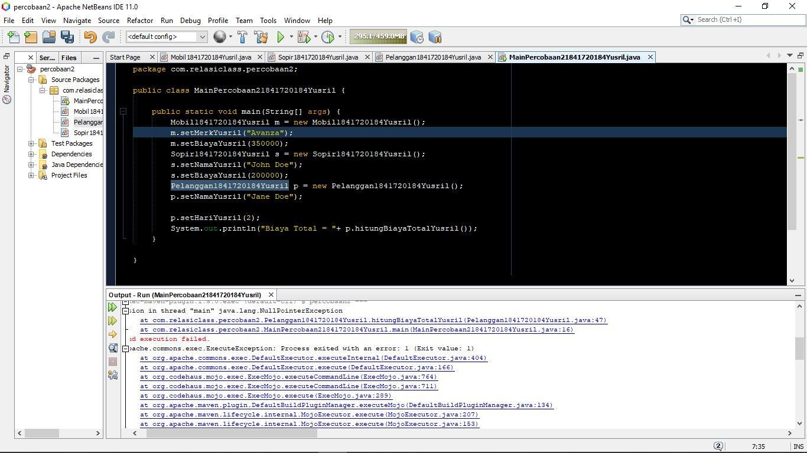

5. untuk menghitung total biaya yang harus dikeluarkan pelanggan. Rumusnya berisi total biaya mobil + total biaya sopir.

6. untuk menampilkan merk yang sudah diberi nilai. Di program ini nilainya berisi "Avanza"

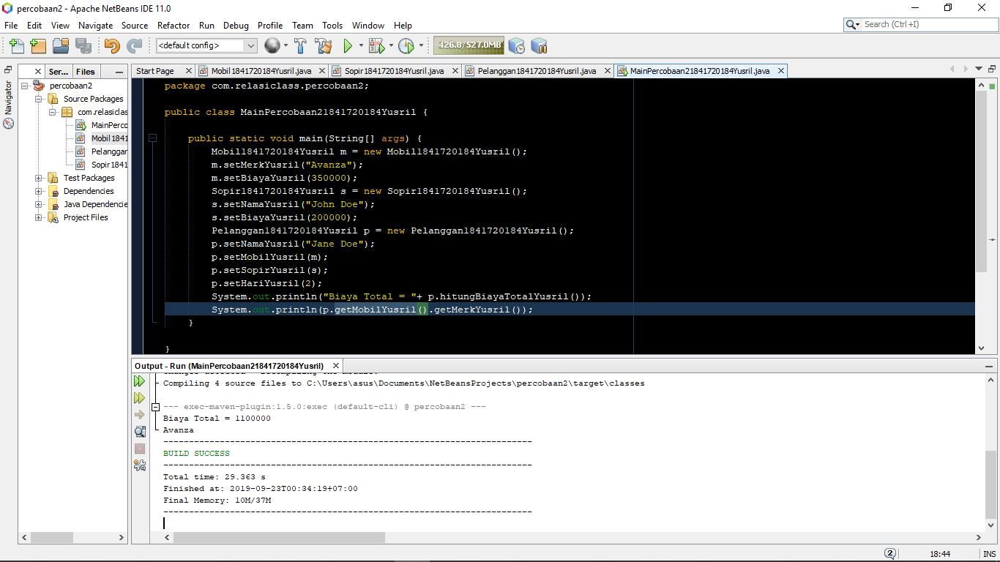
   
### Percobaan 3

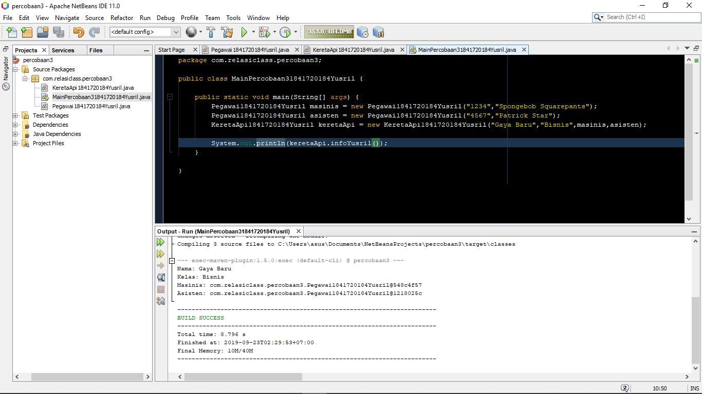

percobaan ke 3 adalah percobaan yang memanfaatkan *multiplicity*, dimana satu class diubah menjadi 2 atau lebih objek.

Link kode program:

- [Main Program](../../src/4_Relasi_Class/MainPercobaan31841720184Yusril.java)

- [Pegawai](../../src/4_Relasi_Class/Pegawai1841720184Yusril.java)

- [Kereta Api](../../src/4_Relasi_Class/KeretaApi1841720184Yusril.java)

#### Pertanyaan

1. digunakan untuk menampilkan data nip dan nama yang sudah di*input*kan pada atribut masing masing objek.

2. 
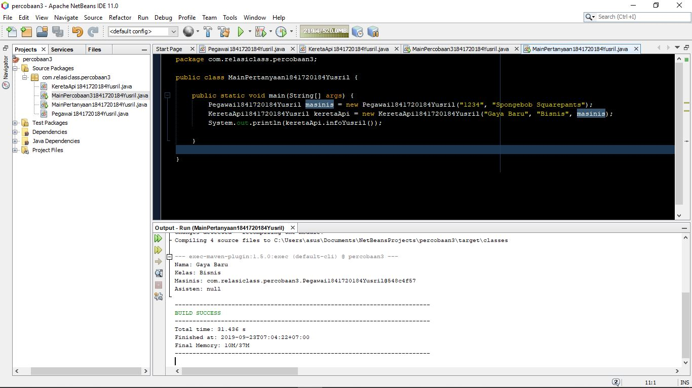

3. hasil output pada masinis memunculkan nama package, bisa terjadi karena perintahnya hanya memanggil nama objek. hasilnya tertera pada jawaban nomer 2 diatas.

4. 
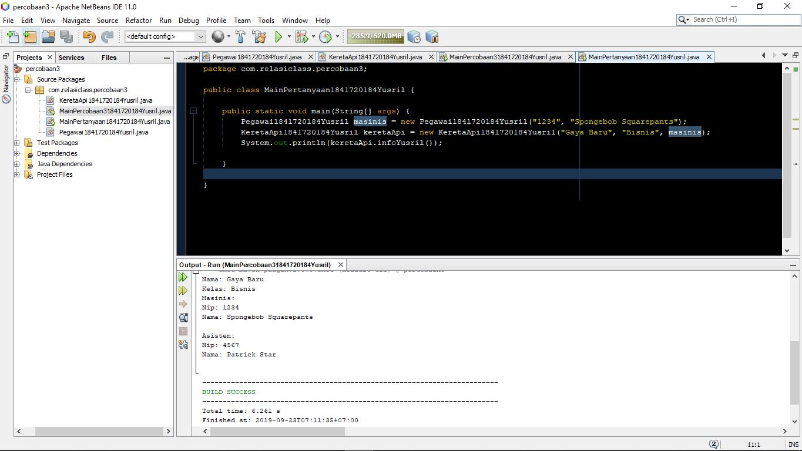

berikut adalah hasil kode program setelah saya perbaiki. Saya memperbaiki perintah pada objek **Kereta Api** di method info() 

### Percobaan 4

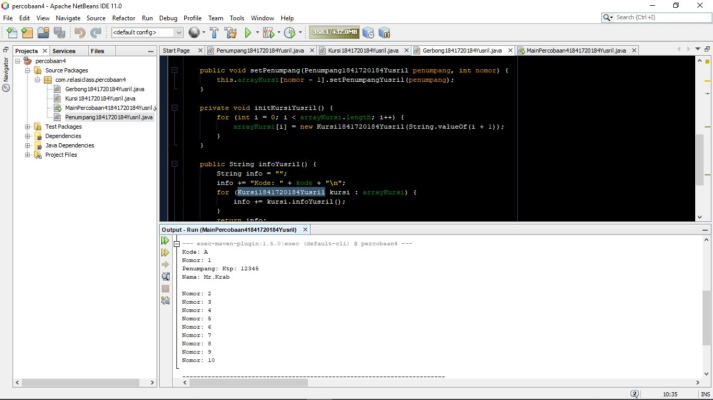

pada percobaan kali ini saya membuat 4 class (1 untuk main percobaan)

Kode Program: 
- [Main Program](../../src/4_Relasi_Class/MainPercobaan41841720184Yusril.java)

- [Penumpang](../../src/4_Relasi_Class/Penumpang1841720184Yusril.java)

- [Kursi](../../src/4_Relasi_Class/Kursi1841720184Yusril.java)

- [Gerbong](../../src/4_Relasi_Class/Gerbong1841720184Yusril.java)

#### Pertanyaan

1. Jumlah kursi yang diinputkan ada 10 kursi

2. kode tersebut digunakan untuk menampilkan data yang terdapat pada method *info()* pada class **Penumpang**

3. karena pada bahasa mesin, penghitungan angka dimulai dari angka 0, sehingga dilakukan pengurangan 1 agar menghindari error.

4. berikut adalah kode program tambahan:

            Penumpang1841720184Yusril budi = new Penumpang1841720184Yusril("45678","Budi");
        gerbong.setPenumpang(budi, 1);

data yang tampil masih sama kareana terjadi overriding. Sehingga data yang baru tidak bisa masuk karena sudah ada data sebelumnya
    

5. Pada class Kursi saya menambahkan kode program berikut:

        public String infoYusril() {
            String info = "";
            info += "Nomor: " + nomor + "\n";
            if (this.penumpang != null) {
                info += "Penumpang: "+ penumpang.infoYusril() +"\n";
            }else{
                System.out.println("Mohon maaf, Kursi sudah ada yang memesan!");
            }
            return info;
        }

dan di bawah ini adalah hasil compile:

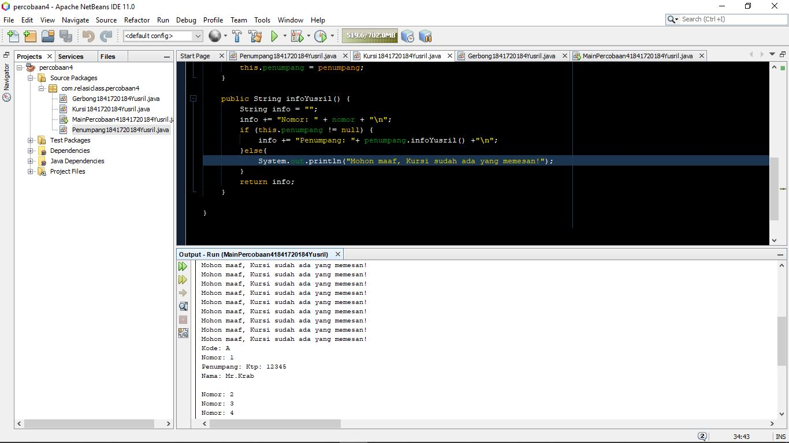
    
## Kesimpulan

Pada bab relasi class ini, menunjukkan bahwa satu class bisa diubah menjadi beberapa objek. Dan juga inheritance tidak terbatas hanya 1 turunan saja, bisa pada 2 turunan dibawahnya.

## Tugas
Saya membuat Sistem Rumah Sakit yang terdiri dari 4 Class yaitu, **Rumah Sakit**, **Dokter**, **Pasien**, dan **Obat**

UML Diagram:
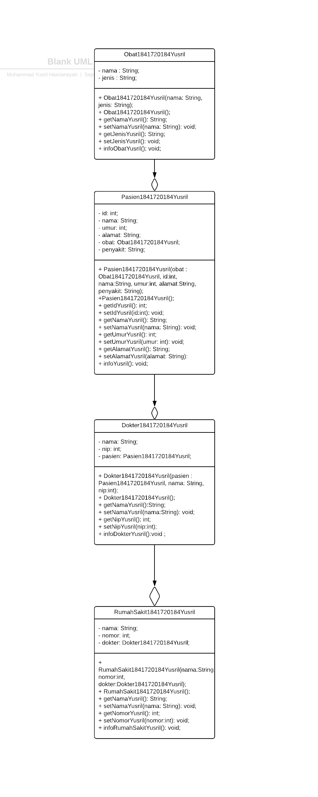

Hasil Screenshot:     
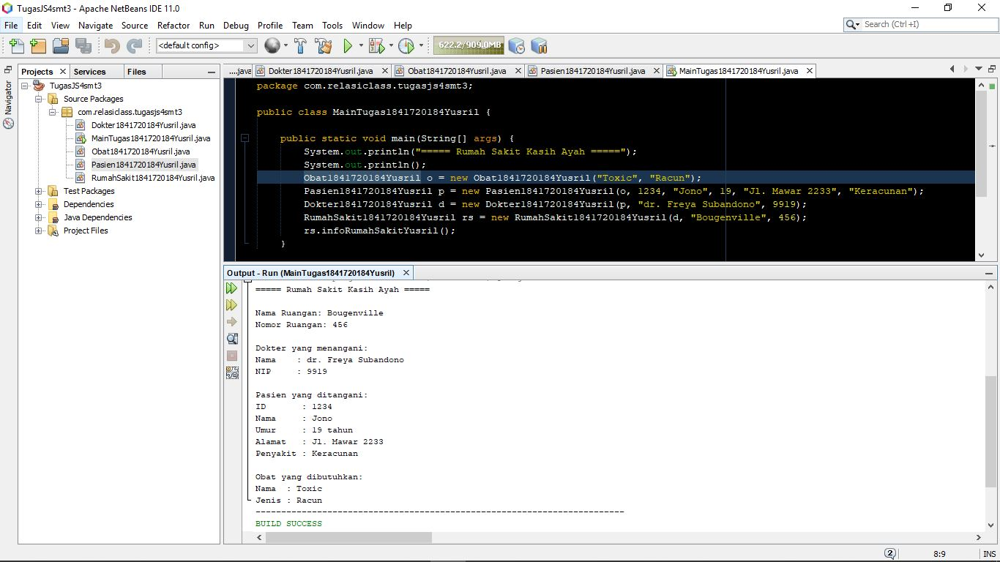

Link kode program :
- [Main Program](../../src/4_Relasi_Class/MainTugas41841720184Yusril.java)

- [Obat](../../src/4_Relasi_Class/Obat1841720184Yusril.java)

- [Dokter](../../src/4_Relasi_Class/Dokter1841720184Yusril.java)

- [Pasien](../../src/4_Relasi_Class/Pasien1841720184Yusril.java)

- [Rumah Sakit](../../src/4_Relasi_Class/RumahSakit1841720184Yusril.java)

## Pernyataan Diri

Saya menyatakan isi tugas, kode program, dan laporan praktikum ini dibuat oleh saya sendiri. Saya tidak melakukan plagiasi, kecurangan, menyalin/menggandakan milik orang lain.

Jika saya melakukan plagiasi, kecurangan, atau melanggar hak kekayaan intelektual, saya siap untuk mendapat sanksi atau hukuman sesuai peraturan perundang-undangan yang berlaku.

Ttd,

***Muhammad Yusril Hasriansyah***
