# Laporan Praktikum #6 - Pengantar Konsep PBO

## Kompetensi
1. Memahami konsep dasar inheritance atau pewarisan.
2. Mampu membuat suatu subclass dari suatu superclass tertentu.
3. Mampu mengimplementasikan konsep	single dan multilevel inheritance.
4. Mampu membuat objek dari suatu subclass dan melakukan pengaksesan terhadap atribut dan method	baik yang dimiliki sendiri atau	turunan dari superclassnya.

## Ringkasan Materi

Inheritance atau pewarisan sifat merupakan suatu cara untuk menurunkan suatu class yang lebih umum menjadi	suatu class yang lebih spesifik.

Inti dari pewarisan adalah sifat reusable dari konsep object oriented. Setiap subclass akan “mewarisi” sifat	dari superclass selama bersifat	protected ataupun public. 

Dalam inheritance terdapat dua istilah yang	sering digunakan. Kelas yang menurunkan disebut kelas dasar **(base class/super class)**, sedangkan kelas yang diturunkan disebut kelas turunan **(derived class/sub class/child class).** Di dalam Java untuk mendeklarasikan	suatu class sebagai subclass dilakukan dengan cara menambahkan kata kunci extends setelah deklarasi nama class, kemudian diikuti dengan nama parent class-­‐nya. Kata kunci	**extends** tersebut memberitahu kompiler Java bahwa kita ingin melakukan perluasan class.

Dalam Inheritance ini saya masih sedikit bingung membedakan dengan *polymorphism*, sering tertukar penggunaan antara keduanya.

## Percobaan

### Percobaan 1
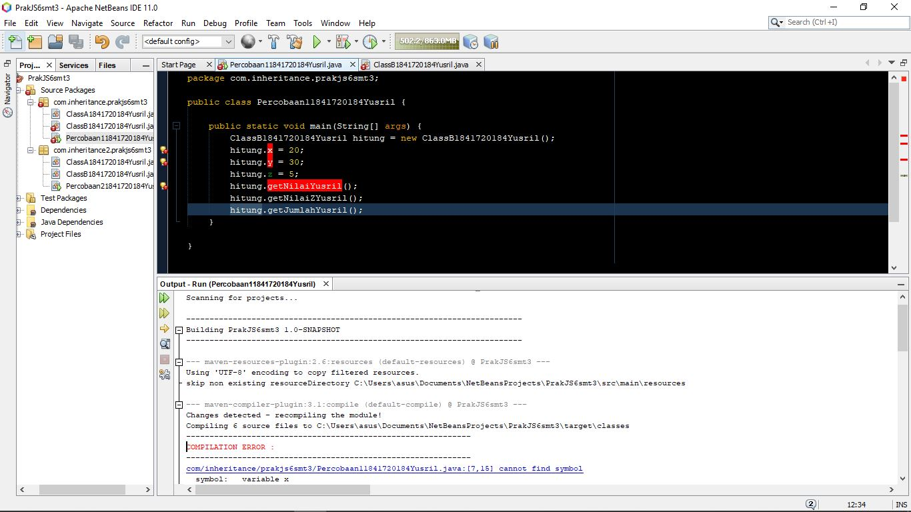

Pada percobaan 1 ini terjadi error pada saat compile karena ada sedikit kesalahan dalam kode programnya. Untuk alasannya akan saya jawab pada pertanyaan nomor 2 di percobaan 1 ini.

Link kode Program:
- [Main Class Percobaan 1](../../src/6_Inheritance/inheritance/prakjs6smt3/Percobaan11841720184Yusril.java)

#### Pertanyaan
1. 
- Class ClassB perbaikan:
    
        package com.inheritance.prakjs6smt3;

        public class ClassB1841720184Yusril extends ClassA1841720184Yusril {

            public int z;
    
            public void getNilaiZYusril() {
                System.out.println("nilai Z: " + z);
            }
    
            public void getJumlahYusril(){
                System.out.println("jumlah: "+(x+y+z));
            }
        }

- Hasil Compile:
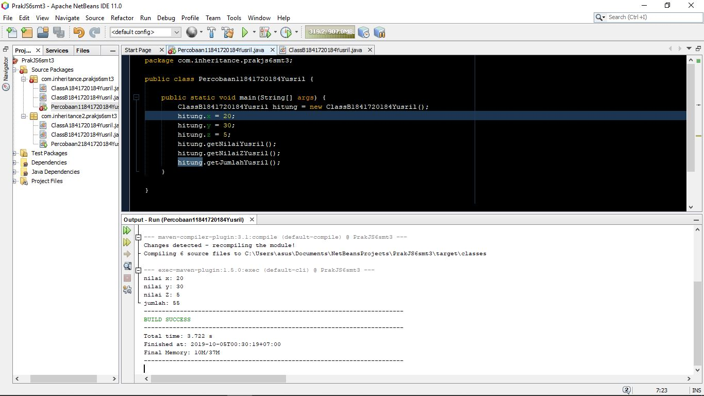

- [ClassA Percobaan 1](../../src/6_Inheritance/inheritance/prakjs6smt3/ClassA1841720184Yusril.java)

- [ClassB Percobaan 1](../../src/6_Inheritance/inheritance/prakjs6smt3/ClassB1841720184Yusril.java)

2. Pada percobaan 1 tadi terjadi error karena pada ClassB belum diberikan **extends**, sehingga variabel x dan y yang berada pada ClassB tidak menurun dari ClassA.

### Percobaan 2

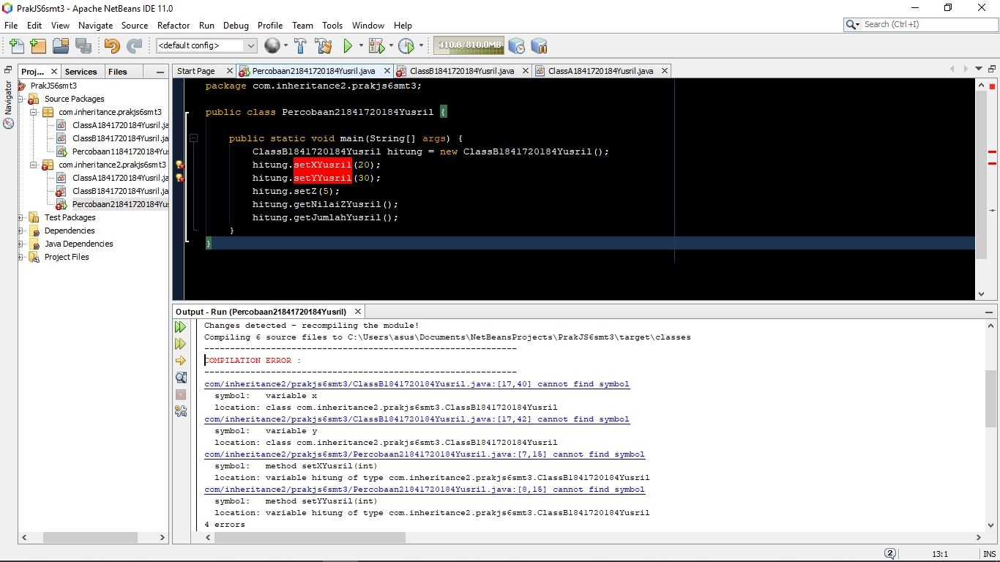 

percobaan 2 diatas adalah hasil modifikasi dari percobaan 1. Di percobaan ini kita melakukan percobaan terhadap hak akses **subclass** terhadap **superclass**. Namun lagi - lagi pada percobaan kali ini terdapat error pada programnya. Untuk oerbaikan berada di jawaban pertanyaan percobaan 2 ini. 

Link Kode Program:
- [Main Class Percobaan 2](../../src/6_Inheritance/inheritance2/prakjs6smt3/Percobaan21841720184Yusril.java)

Kode program ClassA dan ClassB berada di jawaban pertanyaan.

#### Pertanyaan

1. 
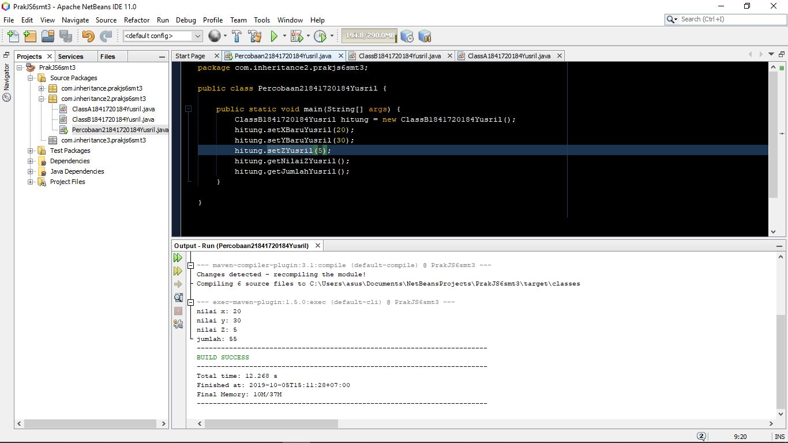  

2. Error terjadi karena variabel x dan y pada **ClassA** berakses *private* sehingga perlu ada method public get untuk mengambil nilai dari variabel x dan y tersebut. Kemudian pada **ClassB** memanggil method tersebut dengan super. Ataua bisa juga dengan mengubah variabel x dan y yang tadinya berakses private menjadi public. 

Link Kode Program ClassA dan ClassB:
- [ClassA percobaan 2](../../src/6_Inheritance/inheritance2/prakjs6smt3/ClassA1841720184Yusril.java)

- [ClassB percobaan 2](../../src/6_Inheritance/inheritance2/prakjs6smt3/ClassB1841720184Yusril.java)

### Percobaan 3
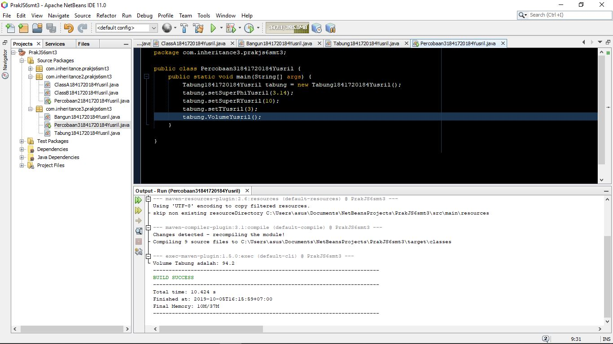

pada percobaan ini menjelasakan tentang penggunaan kata kunci super. Dan saya mengetahui bahwa fungsi super disini bisa sebagai pemanggil variabel maupun method pada class induk.

Link Kode Program:
- [Main Class Percobaan 3](../../src/6_Inheritance/inheritance3/prakjs6smt3/Percobaan31841720184Yusril.java)

- [Bangun Class Percobaan 3](../../src/6_Inheritance/inheritance3/prakjs6smt3/Bangun1841720184Yusril.java)

- [Tabung Class Percobaan 3](../../src/6_Inheritance/inheritance3/prakjs6smt3/Tabung1841720184Yusril.java)

#### Pertanyaan

1. potongan program:
   
        public void setSuperPhiYusril(double phi) {
        super.phi = phi;
        }

        public void setSuperRYusril(int r) {
        super.r = r;
        }
   fungsi dari super pada potongan kode di atas adalah untuk memanggil atribut phi pada superclass yang kemudian akan diisikan data yang terisi pada parameter method pada subclass
   2. potongan kode program:

        public void VolumeYusril() {
            System.out.println("Volume Tabung adalah: " + (super.phi * super.r * this.t));
        }

    fungsi dari super yang selanjutnya (di potongan kode program nomor 2) adalah memanggil atribut phi dan r dari subclass yang sebelumnya sudah diisi pada method **getSuperPhi()** dan **getSuperR()**. Dan kata kunvi this berfungsi untuk memanggil atribut t global yang terdapat pada class itu sendiri. Berfungis untuk menghindari kerancuan dalam pemanggilan variable dengan nama yang sama.

    3. Karena atribut phi dan r sudah ada pada superclass dan sudah diberi akses *protected* yang artinya atribut tersebut bisa diakses paling jauh sampai keturunan dari superclass tersebut. Sehingga pada class **Tabung** bisa mengakses atribut pada superclass tersebut dengan menggunakan kata kunci *super*.

### Percobaan 4

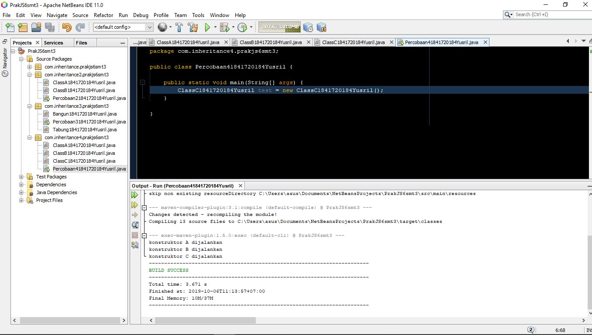

pada percobaan kali ini saya membuat 4 class (1 untuk main percobaan). Di percobaan ini terjadi multilevel inheritance karena adanya subclass yang menjabat menjadi superclass sekaligus. Dengan kata lain ada 3 class sifatnya diturunkan terus menerus.

Kode Program: 
- [Main Class Percobaan 4](../../src/6_Inheritance/inheritance4/prakjs6smt3/Percobaan41841720184Yusril.java)

untuk ClassA, ClassB dan ClassC saya letakkan pada jawaban pertanyaan percobaan 4 karena akan ada modifikasi.

#### Pertanyaan

1. ClassA merupakan superclass dari ClassB dan ClassB merupakan superclass dari ClassC. Sehingga ClassB disini memiliki 2 tugas yaitu sebagai subclass dari ClassA dan sebagai superclass dari ClassC.

2. Outputnya masih tidak ada perubahan.

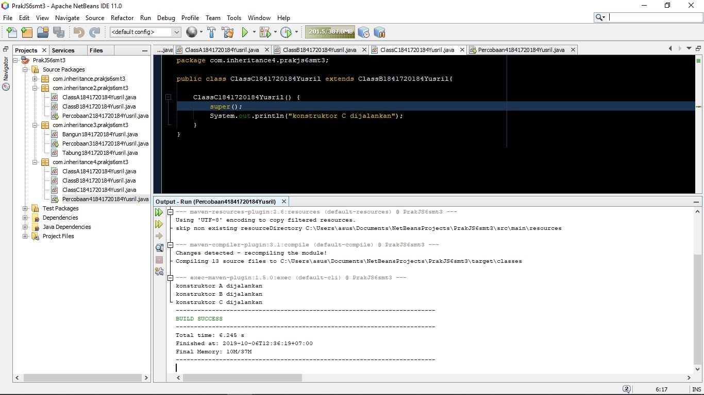

3. Terjadi error karena letak *super konstruktor* harus berada di posisi paling pertama sendiri dalam sebuah method.
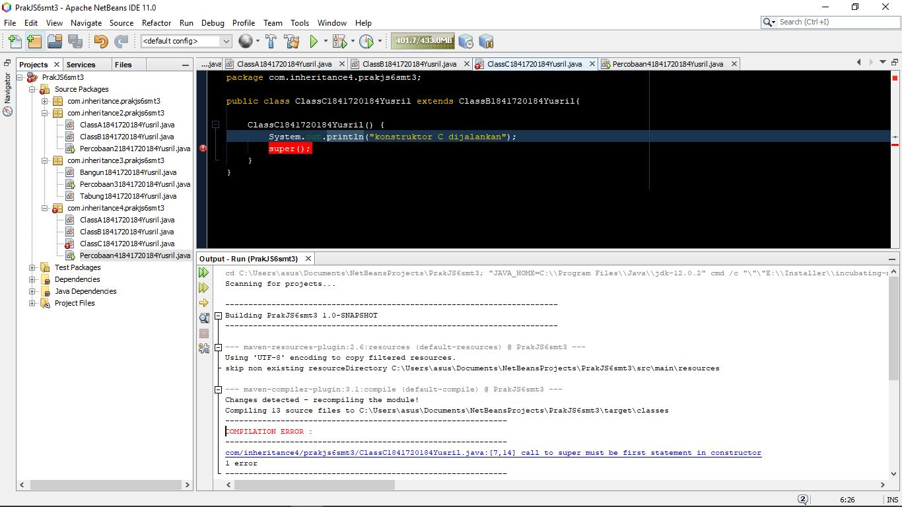

saat *super konstruktor* diletakkan kembali di baris pertama, program berjalan kembali.

Konstruktor dibaca mulai dari superclass paling atas menuju subclass paling bawah.

4. Berfungsi untuk memanggil *konstruktor default* yang ada di superclass.

Kode Program: 
- [ClassA Percobaan 4](../../src/6_Inheritance/inheritance4/prakjs6smt3/ClassA1841720184Yusril.java)

- [ClassB Percobaan 4](../../src/6_Inheritance/inheritance4/prakjs6smt3/ClassB1841720184Yusril.java)

- [ClassC Percobaan 4](../../src/6_Inheritance/inheritance4/prakjs6smt3/ClassC1841720184Yusril.java)

### Percobaan 5

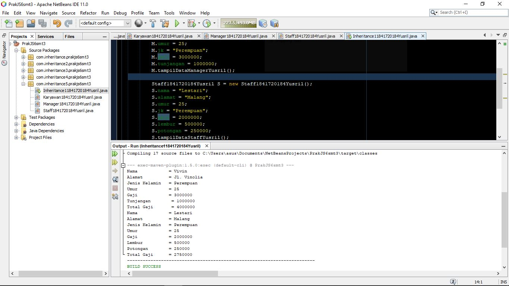

pada percobaan 5 ini terbuat sistem Karyawan yang terbagi menjadi 2 jabatan yaitu Manager dan Staff.

Link Kode Program:

- [Main Class Percobaan 5](../../src/6_Inheritance/inheritance5/prakjs6smt3/Inheritance11841720184Yusril.java)

- [Karyawan Percobaan 5](../../src/6_Inheritance/inheritance6/prakjs6smt3/Staff1841720184Yusril.java)

- [Staff Percobaan 5](../../src/6_Inheritance/inheritance5/prakjs6smt3/Staff1841720184Yusril.java)

- [Manager Percobaan 5](../../src/6_Inheritance/inheritance6/prakjs6smt3/Manager1841720184Yusril.java)

#### Pertanyaan

1. Class Karyawan merupakan superclass sedangkan Class Manager dan Class Staff merupakan subclass.

2. kata kunci extends digunakan untuk menurunkan suatu class ke class lain.

3. di dalam Class Manager terdapat 1 atribut global dari Class Manager itu sendiri yaitu atribut tunjangan dan 5 atribut turunan dari superclass yaitu nama, umur, alamat, jk dan gaji.

4. kata kunci super pada potongan program dibawah:

        System.out.println("Total Gaji      = " + (super.gaji+tunjangan));

berfungsi untuk memanggil atribut gaji yang ada pada Class Karyawan.

5. Inheritance kali ini merupakan **inheritance hierarki** yaitu memanfaatkan 1 superclass untuk digunakan pada 2 atau lebih subclass.

### Percobaan 6

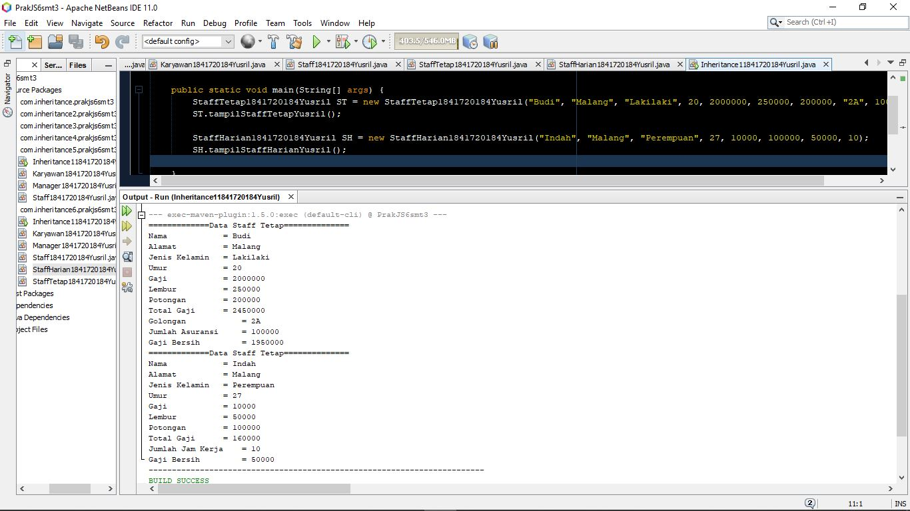

Percobaan 6 ini memadukan antara *single inheritance*,*hierarchy inheritance*, dan *multilevel inheritance* 

Link Kode Program:

- [Main Class Percobaan 6](../../src/6_Inheritance/inheritance6/prakjs6smt3/Inheritance11841720184Yusril.java)

- [Karyawan Class Percobaan 6](../../src/6_Inheritance/inheritance6/prakjs6smt3/Karyawan1841720184Yusril.java)

- [Manager Percobaan 6](../../src/6_Inheritance/inheritance6/prakjs6smt3/Manager1841720184Yusril.java)

- [Staff Percobaan 6](../../src/6_Inheritance/inheritance6/prakjs6smt3/Staff1841720184Yusril.java)

- [Staff Harian Percobaan 6](../../src/6_Inheritance/inheritance6/prakjs6smt3/StaffHarian1841720184Yusril.java)

- [Staff Tetap Percobaan 6](../../src/6_Inheritance/inheritance6/prakjs6smt3/StaffTetap1841720184Yusril.java)

#### Pertanyaan

1. single inheritance adalah Class Karyawan dengan class manager dan multilevel inheritance adalah Class Karyawan -> Class Staff -> Class StaffTetap dan Class StaffHarian

2. 
- Atribut yang dimiliki oleh StaffHarian adalah :
    * (atribut warisan dari Staff) : nama, alamat, jk, umur, gaji, lembur, potongan
    * jmlJamKerja

- Atribut yang dmiliki oleh StaffTetap adalah :
    * (atribut warisan dari Staff) : nama, alamat, jk, umur, gaji, lembur, potongan
    * golongan
    * asuransi

3. berfungsi untuk memanggil konstruktor berparameter pada Class Staff.

4. Untuk memanggil method tampilData yang berfungsi untuk menampilkan data pada superclass.

5. karena pada superclass atribut gaji, lembur dan potongan berakses *public* sehingga Class turunan bisa mengaksesnya dan tidak perlu mendeskripsikan ulang atribut tersebut agar nilainya tidak hilang atau terjadi overriding.

## Tugas

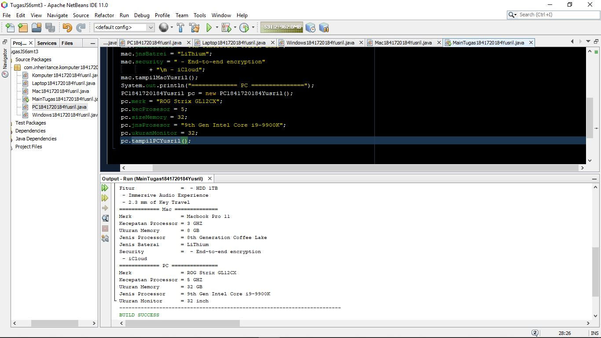

Link kode program:
- [Main Tugas](../../src/6_Inheritance/inheritance_tugas/prakjs6smt3/MainTugas1841720184Yusril.java)

- [Komputer](../../src/6_Inheritance/inheritance_tugas/prakjs6smt3/MainTugas1841720184Yusril.java)

- [Laptop](../../src/6_Inheritance/inheritance_tugas/prakjs6smt3/Laptop1841720184Yusril.java)

- [PC](../../src/6_Inheritance/inheritance_tugas/prakjs6smt3/PC1841720184Yusril.java)

- [Windows](../../src/6_Inheritance/inheritance_tugas/prakjs6smt3/Laptop1841720184Yusril.java)

- [Mac](../../src/6_Inheritance/inheritance_tugas/prakjs6smt3/Mac1841720184Yusril.java)

## Kesimpulan

Inheritance memiliki sekitar 5 jenis, namun pada percobaan ini hanya dijelaskan 2 jenis yaitu *multilevel inheritance* dan *single inheritance*. *single inheritance* hanya memiliki satu subclass dan superclass, sedangkan pada *multilevel inheritance* ada subclass yang juga berperan sebagai superclass.

## Pernyataan Diri

Saya menyatakan isi tugas, kode program, dan laporan praktikum ini dibuat oleh saya sendiri. Saya tidak melakukan plagiasi, kecurangan, menyalin/menggandakan milik orang lain.

Jika saya melakukan plagiasi, kecurangan, atau melanggar hak kekayaan intelektual, saya siap untuk mendapat sanksi atau hukuman sesuai peraturan perundang-undangan yang berlaku.

Ttd,

***Muhammad Yusril Hasriansyah***