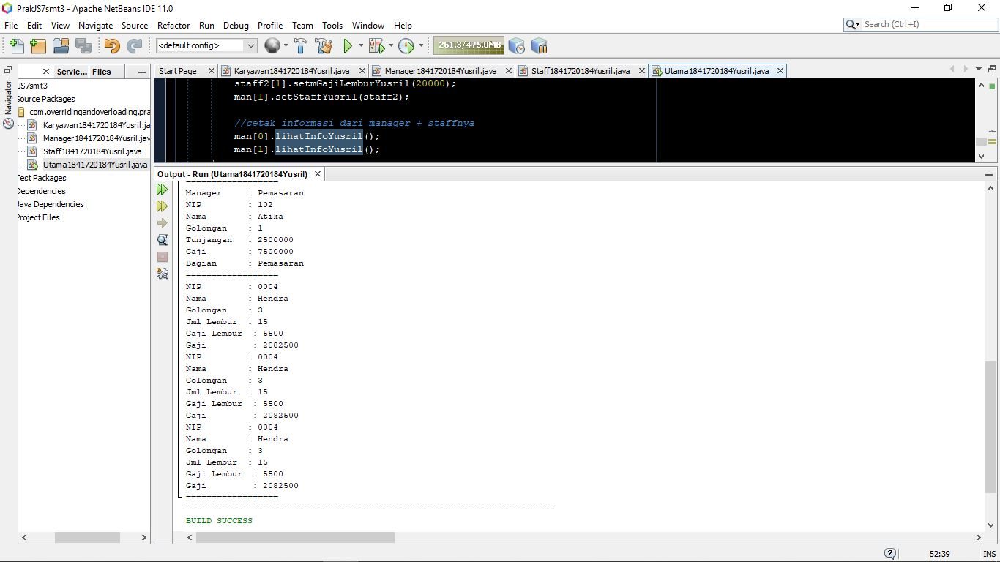
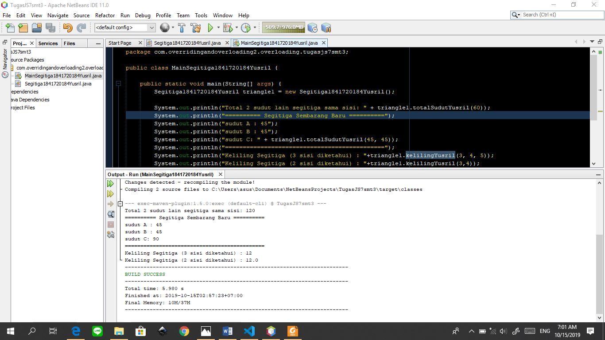
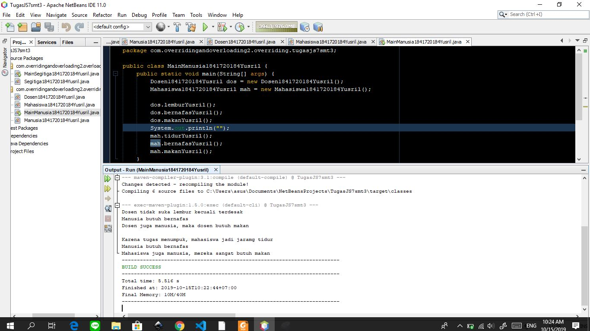

# Laporan Praktikum #7 - Overloading dan Overriding

## Kompetensi
Setelah menempuh pokok bahasan ini, mahasiswa mampu :
a. Memahami konsep overloading dan overriding,
b. Memahami perbedaan overloading dan overriding,
c. Ketepatan dalam mengidentifikasi method overriding dan overloading
d. Ketepatan dalam mempraktekkan instruksi pada jobsheet
e. Mengimplementasikan method overloading dan overriding.

## Ringkasan Materi

Perbedaan Overloading dengan overriding:

- Overloading
adalah menuliskan kembali method dengan nama yang sama pada suatu class. Tujuannya
dapat memudahkan penggunaan/pemanggilan method dengan fungsionalitas yang mirip.

Syarat: 
+ Nama method harus sama
+ Daftar parameter harus berbeda
+ Return type boleh sama, juga boleh berbeda.

- Overriding
adalah Sublass yang berusaha memodifkasi tingkah laku yang diwarisi dari superclass.
Tujuannya subclass dapat memiliki tingkah laku yang lebih spesifik sehingga dapat
dilakukan dengan cara mendeklarasikan kembali method milik parent class di subclass.

Syarat: 
+ Nama method, daftar parameter dan return type harus sama

## Praktikum

pada percobaan ini memanfaatkan kedua pokok bahasan pada materi ini, yaitu **Overloading** dan **Overriding**. Overriding ditandai dengan adanya tanda *@Override* diatas method yang ter override dan Overload biasanya akan muncul pada list *auto correct*  ketika menekan ctrl

Link Kode Program:

- [Main Program](../../src\7_Overriding_dan_Overloading\overridingandoverloading\prakjs7smt3\Utama1841720184Yusril.java)

- [Karyawan](../../src\7_Overriding_dan_Overloading\overridingandoverloading\prakjs7smt3\Karyawan1841720184Yusril.java)

- [Manager](../../src\7_Overriding_dan_Overloading\overridingandoverloading\prakjs7smt3\Manager1841720184Yusril.java)

- [Staff](../../src\7_Overriding_dan_Overloading\overridingandoverloading\prakjs7smt3\Staff1841720184Yusril.java)
## Latihan
1. overloading terdapat pada method perkalian, lebih tepatnya

        void perkalian(int a, int b){
            System.out.println(a * b);
        }

        void perkalian(int a, int b, int c){
            System.out.println(a*b*c);
        }
karena ada perubahan parameter di method perkalian terakhir

2. ada 1 parameter yang berbeda, yaitu int c

3. Overloading terjadi pada kode program:

        void perkalian(int a, int b){
            System.out.println(a * b);
        }

        void perkalian(double a, double b){
            System.out.println(a * b);
        }
Karena adanya perbedaan tipe data parameter pada method yang bernama sama  

4. ada 2 tipe, yaitu int a berubah menjadi double a dan int b berubah menjadi double b

5. overriding terletak pada method swim(); Class Ikan dan Piranha sama sama berisi method swim namun di dalam tiap method swim terdapat perintah yang berbeda sehingga method swim pada Class Piranha mengoverride method swim oada Class Ikan

6. Pada Class Ikan telah terbuat method swim, namun pada saat yang sama, di Class Piranha juga terdapat method swim dengan tipe data yang sama dengan yang ada di Class Ikan, kemudian method swim pada Class Induk (Ikan) akan ter-*override* oleh method swim pada subclass

## Tugas
### Overloading

Tugas yang pertama ini memanfaatkan overloading

Link Kode Program:

- [Segitiga](../../src\7_Overriding_dan_Overloading\overridingandoverloading2\overloading\tugasjs7smt3\Segitiga1841720184Yusril.java)

- [Main Segitiga](../../src\7_Overriding_dan_Overloading\overridingandoverloading2\overloading\tugasjs7smt3\MainSegitiga1841720184Yusril.java)

### Overriding

Link kode program:

- [Manusia](../../src\7_Overriding_dan_Overloading\overridingandoverloading2\overriding\tugasjs7smt3\Manusia1841720184Yusril.java)

- [Dosen](../../src\7_Overriding_dan_Overloading\overridingandoverloading2\overriding\tugasjs7smt3\Dosen1841720184Yusril.java)

- [Mahasiswa](../../src\7_Overriding_dan_Overloading\overridingandoverloading2\overriding\tugasjs7smt3\Mahasiswa1841720184Yusril.java)

- [Main Manusia](../../src\7_Overriding_dan_Overloading\overridingandoverloading2\overriding\tugasjs7smt3\MainManusia1841720184Yusril.java)

## Kesimpulan

 Overloading dan overriding berguna untuk mengefisienkan penamaan method dalam sebuah class yang memiliki keturunan/ inheritance. Overloading adalah method yang memiliki nama sama namun parameternya memiliki jumlah maupun tipe data yang berbeda antara class induk dengan class anak. Sedangkan overriding adalah kegiatan menimpa method dari class induk dengan class anak yang bernama sama.

## Pernyataan Diri

Saya menyatakan isi tugas, kode program, dan laporan praktikum ini dibuat oleh saya sendiri. Saya tidak melakukan plagiasi, kecurangan, menyalin/menggandakan milik orang lain.

Jika saya melakukan plagiasi, kecurangan, atau melanggar hak kekayaan intelektual, saya siap untuk mendapat sanksi atau hukuman sesuai peraturan perundang-undangan yang berlaku.

Ttd,

***Muhammad Yusril Hasriansyah***