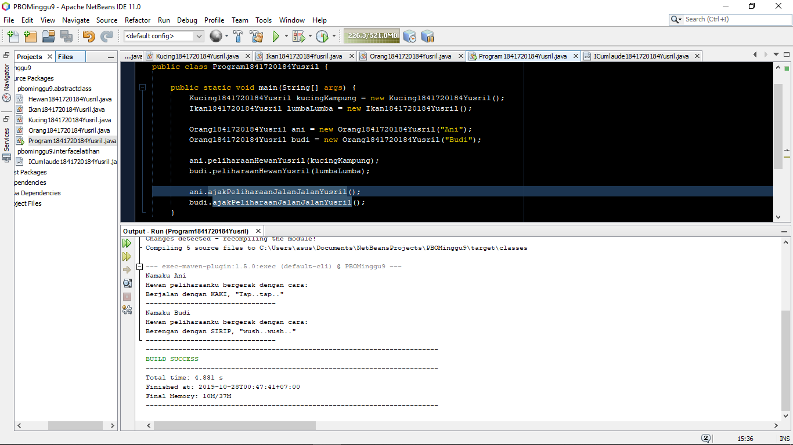
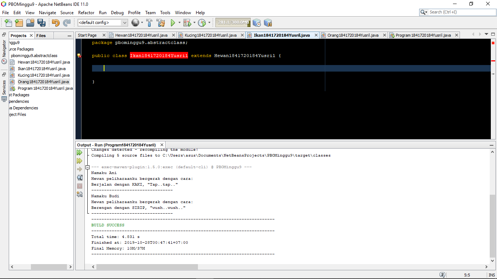
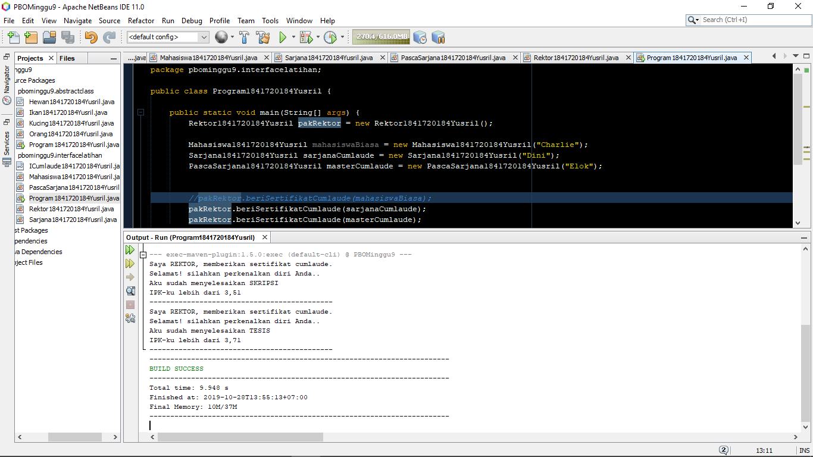
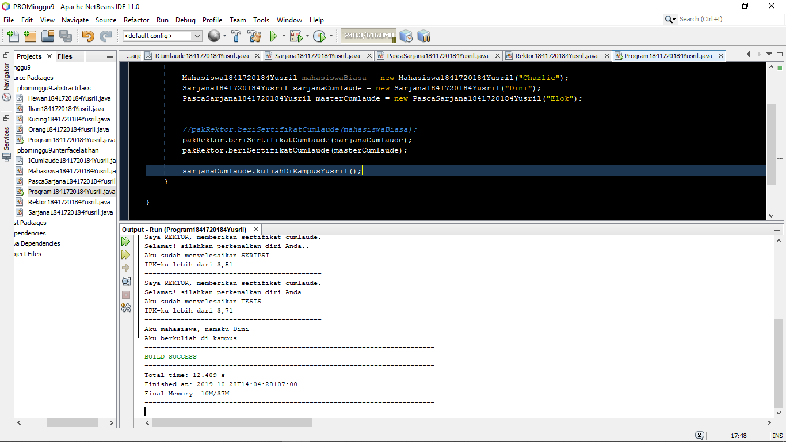
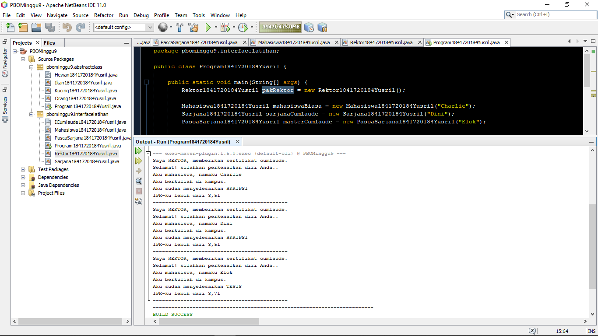
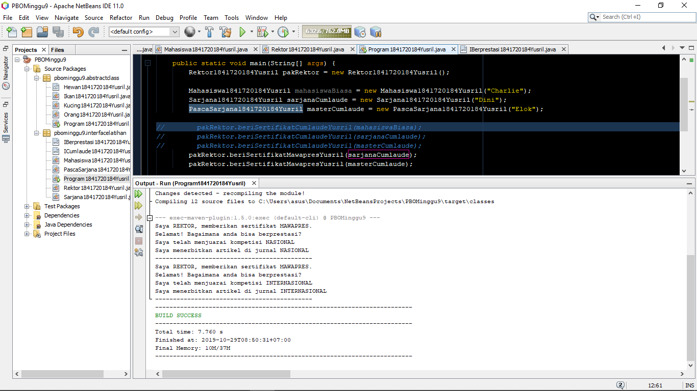

# Laporan Praktikum #9 - Abstract Class dan Interface

## Kompetensi
Setelah menyelesaikan lembar kerja ini mahasiswa diharapkan mampu:
1. Menjelaskan maksud dan tujuan penggunaan Abstract Class;
2. Menjelaskan maksud dan tujuan penggunaan Interface;
3. Menerapkan Abstract Class dan Interface di dalam pembuatan program.

## Ringkasan Materi

1. **Abstract Class**
    Merupakan class yang tidak bisa diinstansiasi secara langsung, melainkan didalamnya harus ada method yang dioverride agar bisa terinstansiasi. Sehingga sifat dari abstrak ini sudah berubah seperti class biasa. Itu menurut sepemahaman saya. setelah praktikum kemarin.

    **Karaksteristik _abstract_ class :**
    - Memiliki atribut dan method.
    - Memiliki method yang tidak memiliki tubuh, disebut juga
    _abstract method_.
    - Selalu dideklarasikan dengan menggunakan kata kunci abstract class.

    **Kegunaan:**

    Menggambarkan sesuatu yang bersifat umum, yang hanya bisa berfungsi setelah ia dideskripsikan ke
    dalam bentuk yang lebih spesifik.

2. **Interface**

    Interface adalah struktur data yang hanya berisi abstract methods. Tidak ada apa-apa selain method
    abstract pada interface, termasuk atribut getter dan setter.

    **Karakteristik:**
    - Tidak ada apa-apa di dalamnya selain abstract methods.
    - Di konvensi bahasa pemrograman Java, namanya dianjurkan untuk selalu diawali dengan huruf
    kapital ‘I’.
    - Selalu dideklarasikan dengan menggunakan kata kunci interface.
    - Diimplementasikan dengan menggunakan kata kunci implements.
    
    **Kegunaan:**
    
    Bertindak seperti semacam kontrak/syarat yang HARUS dipenuhi bagi suatu class agar class tersebut
    dapat dianggap sebagai ‘sesuatu yang lain’.

## Praktikum
### Abstract

Pada percobaan pertama ini kita terfokus pada class abstract. Mulai dari cara pembuatannya hingga hasil akhirnya.

#### Pertanyaan diskusi

sebuah class yang meng-_extend_ suatu _abstract class_ harus mengimplementasikan _method abstract_ yang ada di class induknya. Jika tidak, maka akan terjadi error.

Bukti (muncul error): 

#### Kode Program

- [Main Program](..\..\src\9_Abstract_Class_dan_Interface\abstractclass\Program1841720184Yusril.java)
- [Hewan](..\..\src\9_Abstract_Class_dan_Interface\abstractclass\Hewan1841720184Yusril.java)
- [Orang](..\..\src\9_Abstract_Class_dan_Interface\abstractclass\Orang1841720184Yusril.java)
- [Kucing](..\..\src\9_Abstract_Class_dan_Interface\abstractclass\Kucing1841720184Yusril.java)
- [Ikan](..\..\src\9_Abstract_Class_dan_Interface\abstractclass\Ikan1841720184Yusril.java)

### Interface

Percobaan kedua yaitu tentang interface. Sama seperti abstract class, hanya saja pada interface tidak boleh ada atribut di dalamnya.

#### pertanyaan diskusi

a. Karena ada instansiasi method yang parameternya tidak sesuai dengan seharusnya.

b. iya bisa, karena class **sarjanaCumlaude** meng-_extend_ class **Mahasiswa**

c. tidak bisa, karena parameter bukan berupa method atau beda tipe data.

d. hasil modifikasi

#### Kode Program

- [Main Program](..\..\src\9_Abstract_Class_dan_Interface\interfacelatihan\Program1841720184Yusril.java)
- [Mahasiswa](..\..\src\9_Abstract_Class_dan_Interface\interfacelatihan\Mahasiswa1841720184Yusril.java)
- [Sarjana](..\..\src\9_Abstract_Class_dan_Interface\interfacelatihan\Sarjana1841720184Yusril.java)
- [Pasca Sarjana](..\..\src\9_Abstract_Class_dan_Interface\interfacelatihan\PascaSarjana1841720184Yusril.java)
- [Rektor](..\..\src\9_Abstract_Class_dan_Interface\interfacelatihan\Rektor1841720184Yusril.java)
- [ICumlaude](..\..src\9_Abstract_Class_dan_Interface\interfacelatihan\ICumlaude1841720184Yusril.java)

### Multiple Interfaces Implementation

Pada percobaan ini memanfaatkan interface lebih dari satu pada saat _impelements_ yaitu **ICumlaude** dan **IBerprestasi**.

#### Kode Program

- [Main Program](..\..\src\9_Abstract_Class_dan_Interface\interfacelatihan\Program1841720184Yusril.java)
- [Mahasiswa](..\..\src\9_Abstract_Class_dan_Interface\interfacelatihan\Mahasiswa1841720184Yusril.java)
- [Sarjana](..\..\src\9_Abstract_Class_dan_Interface\interfacelatihan\Sarjana1841720184Yusril.java)
- [Pasca Sarjana](..\..\src\9_Abstract_Class_dan_Interface\interfacelatihan\PascaSarjana1841720184Yusril.java)
- [Rektor](..\..\src\9_Abstract_Class_dan_Interface\interfacelatihan\Rektor1841720184Yusril.java)
- [ICumlaude](..\..src\9_Abstract_Class_dan_Interface\interfacelatihan\ICumlaude1841720184Yusril.java)
- [IBerprestasi](..\..src\9_Abstract_Class_dan_Interface\interfacelatihan\IBerprestasi1841720184Yusril.java)
## Kesimpulan

 Kesimpulan dari praktikum tersebut adalah untuk class abstraksi bisa dipanggil dengan kata kunci _extends_ seperti inheritance sedangkan untuk class interface menggunakan _implements_. Pada class abstract bisa berisi atribut dan method, sedangkan interface hanya bisa berisi method abstract tanpa body.

## Pernyataan Diri

Saya menyatakan isi tugas, kode program, dan laporan praktikum ini dibuat oleh saya sendiri. Saya tidak melakukan plagiasi, kecurangan, menyalin/menggandakan milik orang lain.

Jika saya melakukan plagiasi, kecurangan, atau melanggar hak kekayaan intelektual, saya siap untuk mendapat sanksi atau hukuman sesuai peraturan perundang-undangan yang berlaku.

Ttd,

***Muhammad Yusril Hasriansyah***